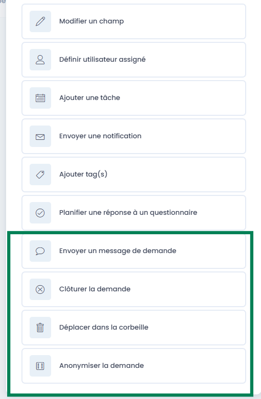

# Zusätzliche Aktionen in automatischen Workflows

Ergänzend zu diesen Funktionen und um Ihnen noch weiterreichende Möglichkeiten bei der Bearbeitung von Betroffenenanfragen zu bieten, haben wir spezifische Aktionen implementiert, die Sie gemäß Ihren Verwaltungsregeln konfigurieren können!

<figure><figcaption>
Spezifische Aktionen für Betroffenenanfragen
</figcaption></figure>


#### Weitere Informationen zu Workflows finden Sie in der [dedizierten Dokumentation](../../settings/workflow-rules.md)

