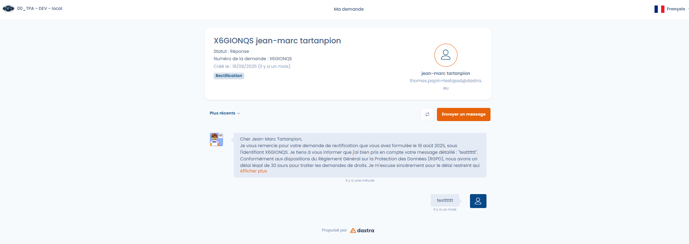

# Antragstellerbereich

Jede Person, die eine Anfrage gestellt hat, erhält Zugang zu einem **dedizierten Bereich**, der durch einen einzigartigen, per E-Mail übermittelten Code gesichert ist.

Von diesem Bereich aus kann der Antragsteller:

* Den Fortschritt seiner Anfrage verfolgen.
* Die von der Organisation gesendeten Nachrichten einsehen.
* Direkt mit dem Verantwortlichen antworten und kommunizieren.
* Dokumente herunterladen oder Nachweisdokumente einreichen.

<figure><figcaption>
Der Austauschbereich mit dem Antragsteller
</figcaption></figure>

Dieser Bereich gewährleistet die Nachverfolgbarkeit, Überwachung und Transparenz des Austauschs und vermeidet gleichzeitig unsichere Übermittlungen per klassischer E-Mail.
