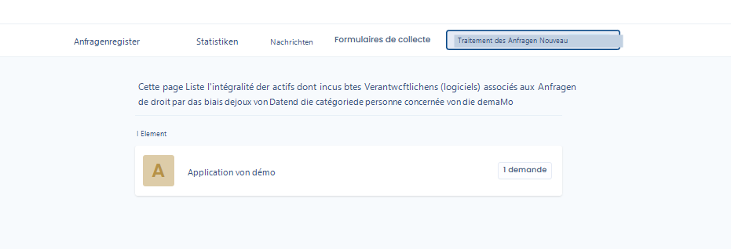
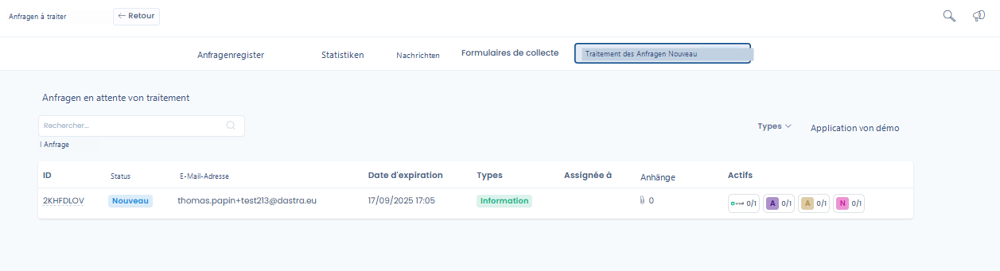
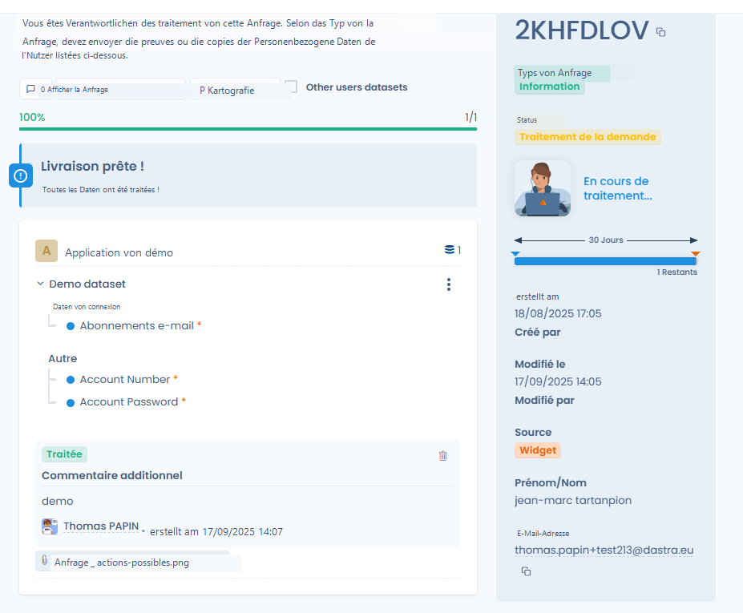

# Bearbeitungsoberfläche für Anfragen (Asset-Inhaber)

Wenn ein Nutzer als **Inhaber eines Assets** definiert ist, das mit einem von einer Anfrage betroffenen Datensatz verknüpft ist, verfügt er über eine dedizierte Oberfläche zur Bearbeitung dieser Anfragen (er hat keinen Zugriff auf die Anfragenliste, aber **er muss über das Zugriffsrecht auf das Referenzsystem verfügen**).

Verfügbare Funktionen:

* Die Liste der zu bearbeitenden Anfragen einsehen.
* Auf die von der Anfrage betroffenen Datensätze zugreifen.
* Nachweise bereitstellen, die angeforderten Daten kopieren oder löschen.
* Die Anfrage als bearbeitet oder als unzulässig markieren mit einem Kommentar.

<figure><figcaption>
Liste der zu bearbeitenden Anfragen
</figcaption></figure>

<figure><figcaption>
Ausstehende Anfragen zur Bearbeitung
</figcaption></figure>

<figure><figcaption>
Beispiel einer bearbeiteten Anfrage
</figcaption></figure>
