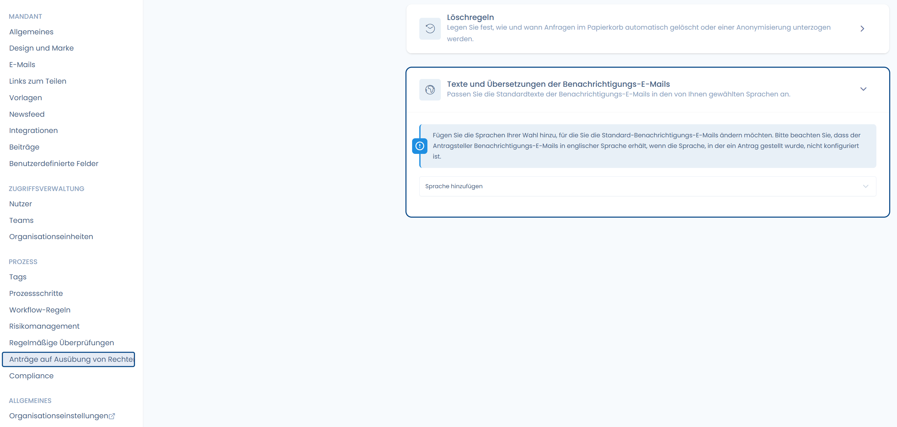
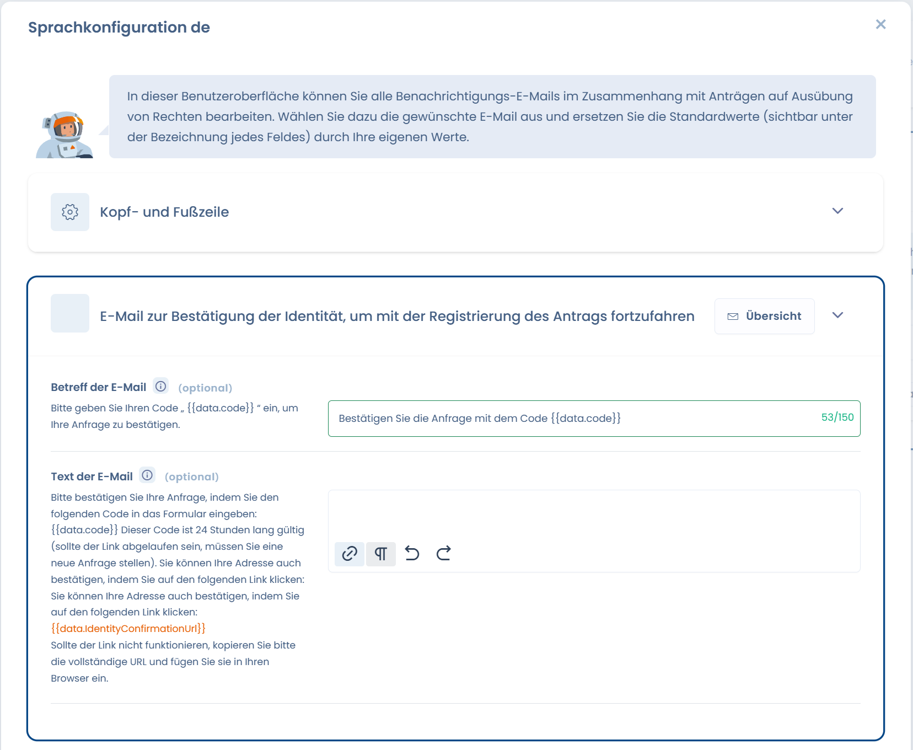

# Anpassung der E-Mails an Antragsteller

Die Oberfläche ermöglicht es Ihnen, alle Benachrichtigungs-E-Mails im Zusammenhang mit Betroffenenanfragen anzupassen, wenn Sie unsere Formulierungen nicht verwenden möchten.\
Sie können:

* Die **Betreffs und Nachrichtentexte** anpassen.
* Die **mehrsprachigen Übersetzungen** verwalten, um E-Mails in der vom Antragsteller gewählten Sprache zu senden.
* Zusätzliche Sprachen hinzufügen (standardmäßig werden E-Mails auf Englisch gesendet, wenn keine Übersetzung definiert ist).

<figure><figcaption>
Anpassung der Sprachen
</figcaption></figure>

<figure><figcaption>
Anpassung einer Nachricht
</figcaption></figure>


Bitte achten Sie auf das eventuelle Vorhandensein von Tags (hier: `{{data.code}}`): Dies bedeutet, dass Daten bei der Nachrichtengenerierung eingefügt werden und für die ordnungsgemäße Funktion erforderlich sind!

Sie können selbstverständlich weitere Informationen im Text hinzufügen (geben Sie `{{` ein, um die Liste der verfügbaren Variablen zu öffnen).

