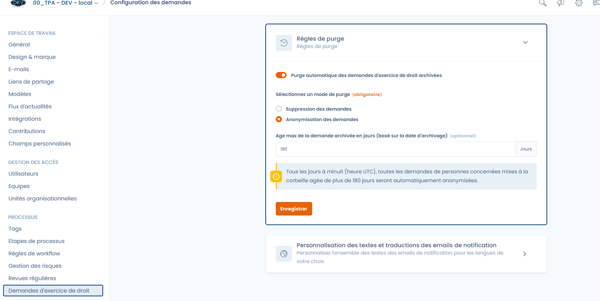

# Löschregeln für Anfragen


Sie müssen über **Administratorrechte** für den Mandanten verfügen, um auf diese Funktion zugreifen zu können.


Sie können die **automatische Löschung von in den Papierkorb verschobenen Anfragen** konfigurieren, um Ihre internen Aufbewahrungsrichtlinien und insbesondere den in der DSGVO vorgesehenen Grundsatz der Speicherbegrenzung einzuhalten.

Diese Funktion ermöglicht es Ihnen, Folgendes festzulegen:

* den **Umfang** der von der Löschung betroffenen Anfragen,
* den **Verarbeitungsmodus** (Löschung oder Anonymisierung),
* und die **maximale Aufbewahrungsdauer** vor automatischer Auslösung.

***

#### 🔍 Kriterien für die Datenauswahl

Die Löschung gilt **ausschließlich für Anfragen im Papierkorb**.\
Anfragen, die sich noch in Bearbeitung befinden, abgeschlossen oder archiviert sind, **sind nicht betroffen**.

Jede Nacht prüft Dastra die Anfragen anhand ihres **Datums der Verschiebung in den Papierkorb**.\
Wenn eine Anfrage die festgelegte maximale Dauer überschreitet (z. B. 180 Tage), wird sie für die Löschung freigegeben.

**Betroffen sind daher:**

* Anfragen, die **länger als die konfigurierte Dauer im Papierkorb** liegen;
* Alle Anfragetypen (Auskunft, Löschung, Widerspruch usw.);
* Unabhängig von ihrer Herkunft (Portal, API, Import).

***

#### ⚙️ Verfügbare Löschmodi

**1. Löschung der Anfragen**

Die betroffenen Anfragen werden **endgültig aus dem System gelöscht**.\
Diese Aktion ist **unwiderruflich**.

Auswirkungen:

* Personenbezogene Daten und der Inhalt des Austauschs werden dauerhaft gelöscht;
* Anhänge und zugehörige Dateien werden gelöscht;
* Die Audit-Protokolle bewahren nur technische Metadaten (Zeitstempel, Nutzer, Vorgang).

***

**2. Anonymisierung der Anfragen**

Die Anfragen bleiben in Dastra sichtbar, aber **alle darin enthaltenen personenbezogenen Daten** werden **durch fiktive Werte ersetzt**.

Diese Option ermöglicht die Beibehaltung einer **nicht identifizierbaren statistischen Spur** für Ihre Berichte und Indikatoren.

Konkret:

* Felder mit personenbezogenen Daten (Name, Vorname, E-Mail, Kennung, Nachricht usw.) werden durch generische Werte ersetzt (`John DOE`, `anonymized@example.com`, `XXXXXX`);
* Anhänge werden gelöscht;
* Nicht identifizierende Metadaten (Anfragetyp, Status, Daten) werden für das Reporting beibehalten.
* Die zugehörigen Aktivitätsprotokolle (Logs) werden gelöscht.

> 💡 **Ziel:** Ermöglichung der statistischen Nachverfolgung bei gleichzeitiger Gewährleistung der Löschung aller identifizierbaren Informationen.

<figure><figcaption></figcaption></figure>

***

#### ⏱️ Dauer vor der Löschung festlegen

Ein Parameter ermöglicht es Ihnen, das **maximale Alter einer Anfrage im Papierkorb** vor der Löschung festzulegen (Beispiel: 180 Tage).\
Diese Frist wird ab dem **Datum der Verschiebung in den Papierkorb** berechnet.

Jede Nacht um Mitternacht (UTC) ruft Dastra die betroffenen Anfragen ab und führt die Löschung automatisch gemäß dem ausgewählten Modus durch.

***

#### 🧩 Konfigurationsbeispiel

* **Löschmodus:** Löschung der Anfragen
* **Maximale Dauer:** 180 Tage (6 Monate)

\
➡️ Jede Nacht werden alle Anfragen, die seit mehr als 180 Tagen im Papierkorb liegen, automatisch gelöscht.

***

#### ✅ Bewährte Praktiken

* Legen Sie eine Aufbewahrungsdauer fest, die mit Ihrer internen Richtlinie zur Aufbewahrung von Anfragen übereinstimmt (z. B. 5 Jahre oder 1825 Tage).
* Verwenden Sie die **Löschung** für eine vollständige Entfernung.
* Verwenden Sie die **Anonymisierung**, wenn Sie Aktivitätsstatistiken beibehalten möchten.
* Stellen Sie sicher, dass die automatische Löschung **aktiviert** ist, damit die Verarbeitung jede Nacht ausgeführt wird.
