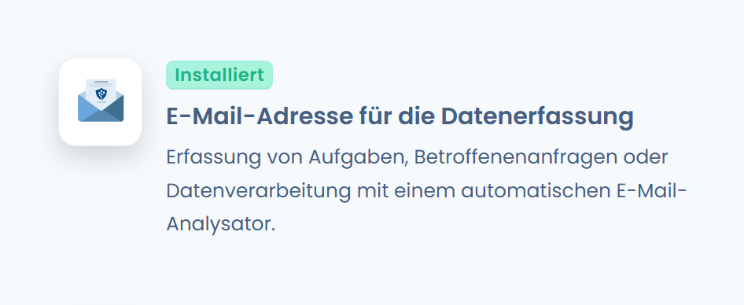
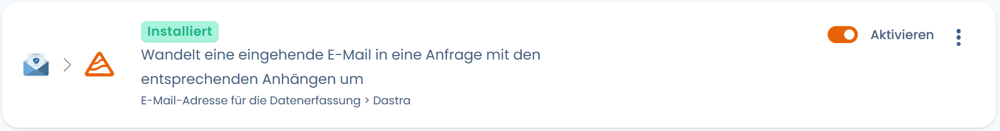
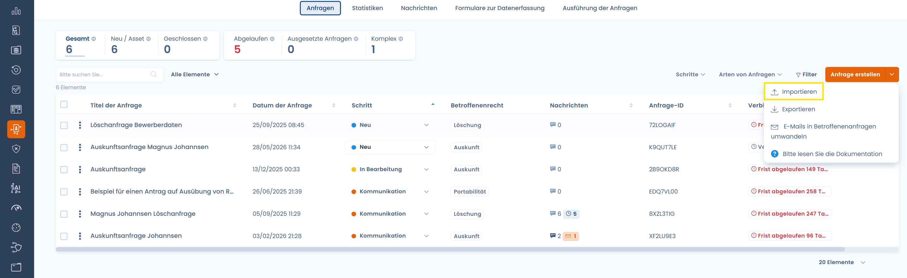

# Verwaltung von Betroffenenanfragen

## Erstellung einer Betroffenenanfrage

Die Erstellung einer Betroffenenanfrage kann in Dastra auf 3 verschiedene Arten erfolgen:

1. Manuelle Erstellung einer Anfrage
2. Automatisch über eine Sammel-E-Mail-Adresse
3. Automatisch über ein Formular zur Erfassung von Anfragen.

### Manuelle Erstellung einer Anfrage

Um eine neue Anfrage manuell direkt aus dem Verzeichnis der Betroffenenanfragen zu erstellen, klicken Sie auf das Modul "Betroffenenanfragen" und dann auf die Schaltfläche "**Anfrage erstellen**".

<figure><figcaption>
Das Verzeichnis der Betroffenenanfragen
</figcaption></figure>


Sie können Betroffenenanfragen auch automatisch erstellen (siehe nachfolgend).


### Erstellung einer Anfrage über eine Sammel-E-Mail-Adresse

Um eine oder mehrere Betroffenenanfragen über eine Sammel-E-Mail-Adresse in Dastra zu erstellen, müssen Sie zunächst die [Integration "E-Mail-Adresse für die Datenerfassung"](../settings/data-collection-mailboxes.md) aktivieren.

Gehen Sie dazu in die **Einstellungen** des Mandanten, dann in den Bereich "**Integrationen**" und klicken Sie auf "**E-Mail-Adresse für die Datenerfassung**".

<figure><figcaption>
Die Integration "E-Mail-Adresse für die Datenerfassung" in Dastra.
</figcaption></figure>


Falls diese Integration noch nicht installiert ist, installieren Sie sie.


Klicken Sie anschließend auf den vorkonfigurierten Anwendungsfall "**Verwandelt eine eingehende E-Mail in eine Betroffenenanfrage mit den zugehörigen Anhängen**". Eine E-Mail-Adresse wird automatisch generiert.

<figure><figcaption></figcaption></figure>

So wird jede an diese Adresse gesendete E-Mail automatisch in eine Betroffenenanfrage in Dastra umgewandelt!

### Automatische Erstellung einer Anfrage über ein Formular zur Erfassung von Betroffenenanfragen

Um eine Betroffenenanfrage automatisch über ein Formular zur Erfassung von Anfragen zu erstellen, siehe die Seite "Widget zur Erfassung von Anfragen" unten:


[implementez-un-widget-dexercice-des-droits.md](implementez-un-widget-dexercice-des-droits.md)


## Import / Export der Anfragen

Klicken Sie auf das Menü oben rechts und auf die Schaltfläche "Importieren".

<figure><figcaption></figcaption></figure>

Folgen Sie anschließend dem Leitfaden zum [Datenimport in Dastra](../generalites/importer-vos-donnees-excel-csv.md).

Um zu exportieren, klicken Sie auf die Schaltfläche "Exportieren" in derselben Oberfläche.
