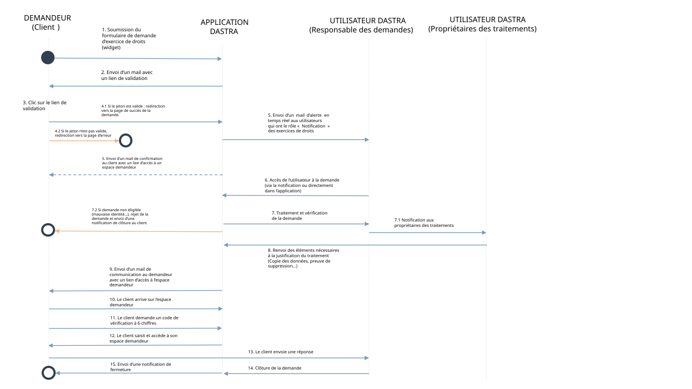
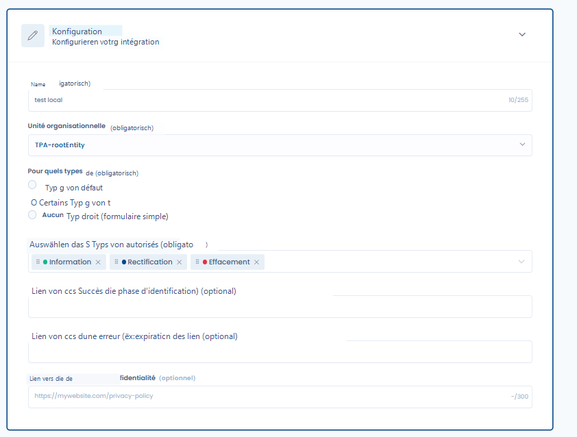
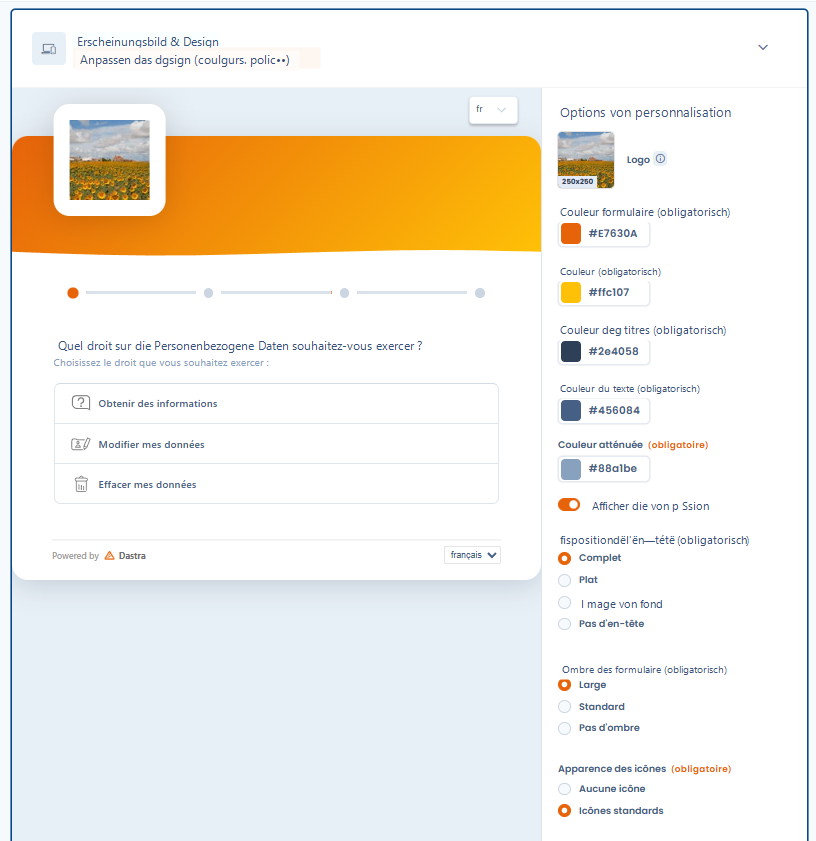
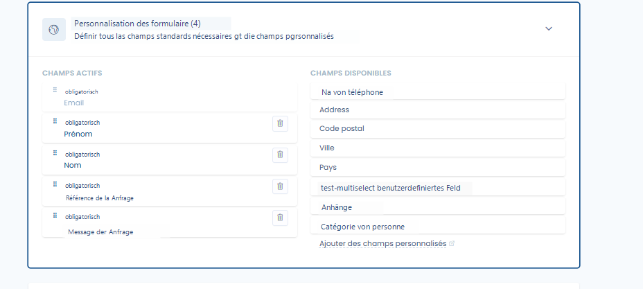
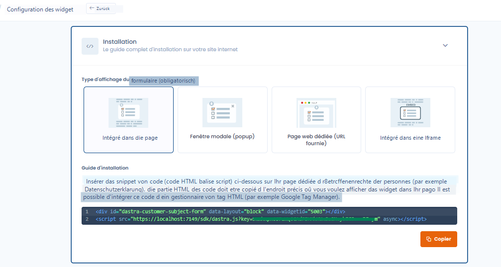
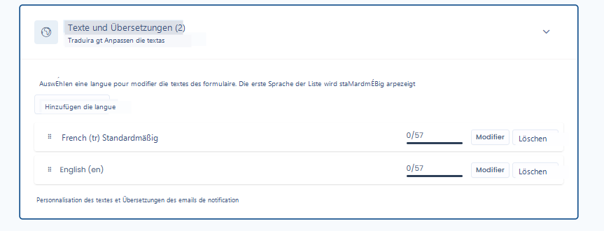
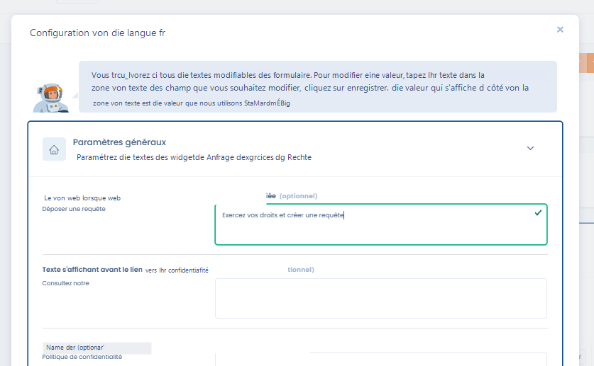

# Ein Widget für Betroffenenanfragen implementieren

## Ein Widget für Betroffenenanfragen implementieren

Das Dastra-Widget ermöglicht es Ihnen, ein Formular für Betroffenenanfragen direkt auf Ihrer Website einzufügen.\
Es ist vollständig anpassbar und bietet:

* **Allgemeine Konfiguration**: Auswahl der Rechte, Weiterleitungen, Datenschutzrichtlinie.
* **Visuelle Anpassung**: Farben, Logos, Hintergrundbilder, Symbole, Fortschrittsbalken.
* **Benutzerdefinierte Felder**: Fügen Sie eigene Felder hinzu, um die benötigten Informationen zu erfassen.
* **Integrationsmodi**: Einbettung in eine Seite, Popup, iFrame oder dedizierte URL.
* **Mehrsprachig**: Übersetzen und passen Sie alle Texte des Widgets an.

***

### Integrations-Workflow

Hier ist das allgemeine Schema der Funktionsweise eines Widgets für Betroffenenanfragen in Dastra:

Dieses Diagramm veranschaulicht den Prozess:

1. Die betroffene Person reicht eine Anfrage über das Widget ein.
2. Die Anfrage wird an Dastra übermittelt und gespeichert.
3. Sie werden benachrichtigt und können sie in der Plattform qualifizieren und bearbeiten.
4. Die betroffene Person erhält eine Antwort über das Antragstellerportal.

***

### Allgemeine Konfiguration

Bei der Erstellung eines Widgets legen Sie fest:

* Den **Namen des Widgets** und die betroffene **Organisationseinheit**.
* Die **verfügbaren Rechtstypen** (Auskunft, Berichtigung, Löschung usw.).
* Die Weiterleitungslinks (Erfolg, Fehler, Datenschutzrichtlinie).

<figure><figcaption>
Konfiguration des Widgets
</figcaption></figure>

***

### Anpassung des Erscheinungsbilds

Sie können das Erscheinungsbild des Formulars an Ihr Corporate Design anpassen.

Verfügbare Optionen:

* **Logo** und **Hintergrundbild**.
* Farben: primär, sekundär, Titel, Text, gedämpft.
* Kopfzeilenlayout: vollständig, flach, Hintergrundbild oder keine Kopfzeile.
* Formularschatten: groß, standard oder keiner.
* Erscheinungsbild der Symbole.
* Anzeige des Fortschrittsbalkens.
* Benutzerdefiniertes CSS (für "Experten")

<figure><figcaption>
Passen Sie das Erscheinungsbild des Widgets an
</figcaption></figure>

***

### Anpassung der Felder

Sie können die Felder auswählen, die im Formular erscheinen.

* Bestimmte Felder sind Pflichtfelder (E-Mail, Vorname, Nachname, Anfrage-Referenz, Nachricht).
* Sie können optionale Felder hinzufügen (Telefon, Adresse, Postleitzahl, Stadt, Land usw.).
* Möglichkeit, eigene **benutzerdefinierte Felder** hinzuzufügen.

<figure><figcaption>
Passen Sie die verfügbaren Felder im Widget an
</figcaption></figure>

***

### Bedingte Logik (Skip Logic)

Es ist möglich, **bedingte Anzeigeregeln** direkt auf den Feldern des DSR-Widget-Modells zu definieren: Ein Feld erscheint nur, wenn die Antwort auf eine vorherige Frage eine definierte Bedingung erfüllt.

Diese Regeln werden dynamisch auf Seiten des Befragten interpretiert - das Formular passt sich in Echtzeit an, während die Antworten eingegeben werden.

Dies ermöglicht Ihnen:

* Felder je nach Art des ausgeübten Rechts, der Art der Anfrage oder einer vorherigen Antwort ein- oder auszublenden
* Mehrere Szenarien innerhalb eines **einzelnen Widgets** zu verwalten, ohne für jede Variante ein separates Formular erstellen und pflegen zu müssen
* Den Wartungsaufwand bei inhaltlichen Änderungen oder Compliance-Anforderungen zu reduzieren

***

### Installation des Widgets

Das Widget kann auf verschiedene Arten integriert werden:

* **In die Seite eingebettet** (HTML-Snippet).
* **Modales Fenster (Popup)**.
* **Dedizierte Webseite** (bereitgestellte URL).
* **In einem iFrame eingebettet**.

Der bereitgestellte Code ist ein HTML + JavaScript-Snippet, das auf Ihrer Website oder in einem Tag-Manager (z. B. Google Tag Manager) eingefügt werden kann.

<figure><figcaption>
Installationsanleitung
</figcaption></figure>

***

### Texte und Übersetzungen

Das Widget ist mehrsprachig: Sie können mehrere Sprachen hinzufügen und die Übersetzungen anpassen.\
Die erste Sprache in der Liste wird standardmäßig angezeigt.

<figure><figcaption>
Anpassung der Widget-Texte
</figcaption></figure>

Für jede Sprache können Sie die angezeigten Texte ändern:

* Seitenname (bei Integration als dedizierte Seite).
* Texte vor den Links zur Datenschutzrichtlinie.
* Schaltflächen- oder Anleitungstexte.

<figure><figcaption>
Ändern Sie einen Teil des Textes ganz einfach
</figcaption></figure>

***

### Ergebnis auf Nutzerseite

Das so konfigurierte Widget ermöglicht es betroffenen Personen, die Art des Rechts auszuwählen, das sie ausüben möchten, und ihre Anfrage einfach einzureichen.\
Das Formular passt sich automatisch an die Konfiguration an (Sprachen, Erscheinungsbild, Felder).

***
