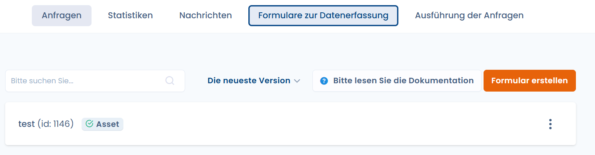

# Technische Integration

### Ziele

Das Widget für Betroffenenanfragen ermöglicht es Ihnen, **automatisch von einer Seite Ihrer Website Betroffenenanfragen** verschiedener Typen zu erfassen (Löschungen, Änderungen, Berichtigungen...)

Das Widget ist in das **JavaScript-SDK** von Dastra integriert.

### Voraussetzungen

Um das Widget für Betroffenenanfragen einzurichten, benötigen Sie einen **öffentlichen API-Schlüssel**: [Dokumentation lesen](https://doc.dastra.eu/~/changes/OdM7a8W4pn3S8n18W72A/features/settings/gestion-des-cles-dapi) oder [direkt zur API-Schlüsselverwaltung navigieren](https://app.dastra.eu/general-settings/api)

### Einrichtung des Widgets in der dedizierten Oberfläche

Zunächst müssen Sie **das Widget einrichten** im [Verwaltungspanel für Widgets](https://app.dasta.eu/workspace/data-subject-request/integrations) für Betroffenenanfragen:



Hier ist ein einfaches Integrationsbeispiel des Widgets (im Popup-Modus mit einer Öffnungsschaltfläche):

```html
<div id="customer-subject-form-custom"></div>
<button id="customer-request-button">Open the widget</button>
<script
  src="https://cdn.dastra.eu/sdk/dastra.js?key={YOUR PUBLIC KEY}"
  async
></script>
<script>
  window.dastra = window.dastra || [];
  dastra.debug = true;
  window.dastra.push(function(){
    dastra.loadCustomerSubjectForm({
      selector: '#customer-subject-form-custom',
      widgetId: {your widget id},
      onLoad: function (form) {
        document.getElementById('customer-request-button').addEventListener('click',function () {
          form.open()
        })
      }
    })
  })
</script>
```

### Wie erzwingt man die Sprache des Formulars?

Standardmäßig wird die **Browsersprache** verwendet. Wenn die Sprache in den Widget-Übersetzungen nicht verfügbar ist, wird automatisch die Standardsprache ausgewählt. Sie können die aktuelle Sprache des Widgets erzwingen, indem Sie die Eigenschaft **data-lang** zum div hinzufügen, in dem das Formular angezeigt wird.

_In diesem Beispiel wird standardmäßig Italienisch ausgewählt (wenn verfügbar)_

```html
<div id="customer-subject-popup" data-lang="it"></div>
```

#### Wie sendet man automatisch Formularwerte an das Widget?

Es ist möglich, die Formularfelder aus dem Authentifizierungskontext des Nutzers vorauszufüllen. Die vorausgefüllten Felder werden auf Nutzerseite **schreibgeschützt** (ausgegraut) angezeigt.

**Verfügbare Standardfelder:**

```javascript
dastra.push(['set', 'dsr:refId', '{identifiant_unique_utilisateur}'])
dastra.push(['set', 'dsr:email', '{email}'])
dastra.push(['set', 'dsr:givenName', '{prénom}'])
dastra.push(['set', 'dsr:familyName', '{nom}'])
dastra.push(['set', 'dsr:address', '{adresse}'])
dastra.push(['set', 'dsr:zipCode', '{code_postal}'])
dastra.push(['set', 'dsr:city', '{ville}'])
dastra.push(['set', 'dsr:countryCode', '{code_pays}']) // ex : "FR"
dastra.push(['set', 'dsr:phoneNumber', '{téléphone}'])
dastra.push(['set', 'dsr:message', '{message}'])
```

**Benutzerdefinierte Felder:**

```javascript
// Passer un objet complet
var payload = {
  customFieldSlug1: 'valeur1',
  customFieldSlug2: 'valeur2'
}
dastra.push(['set', 'dsr:additionalDatas', payload])

// Ou champ par champ (préfixe @)
dastra.push(['set', 'dsr:@customFieldSlug1', 'valeur1'])
```

### Senden von Parametern im Seitenmodus

Es ist auch möglich, diese Parameter über Querystring-Parameter zu übergeben. Dazu muss dem Parameternamen das Präfix dsr\_ vorangestellt werden:

```url
https://api.dastra.eu/v1/client/customer-subject-form?id=<Your widget id>
&key=<your public key>
&dsr_email=test@github.org
&dsr_givenName=Dastonaute
&dsr_refId=123456
&...etc...
```

### Widget durch Klicken außerhalb des Fensters schließen

Wenn Ihr Widget mit dem **Anzeigetyp "Popup"** konfiguriert ist, haben wir das Schließverhalten des Modals bei Klick außerhalb des Fensters nicht implementiert, da das Risiko des Verlusts der vom Nutzer eingegebenen Daten zu hoch ist.

Wenn Sie jedoch möchten, dass sich das Widget schließt, wenn der Nutzer außerhalb des Widgets klickt, können Sie dies mit folgendem Code umsetzen:

```javascript
window.dastra.customerSubjectReady().then((form) => {
  form.closeOnBackdrop = true
})
```


Achtung, dies hat zur Folge, dass der gesamte vom Nutzer eingegebene Text ohne jegliche Warnung gelöscht wird! Wenn das Formular lang ist, kann dies leicht bei einer Auswahl auftreten, die über ein langes Textfeld hinausgeht.


### Mehrere Widgets in einer einzelnen Seite integrieren

Standardmäßig erlaubt Dastra nicht die Integration mehrerer Widgets innerhalb derselben Seite.

Es ist jedoch möglich, diese Integration mit der folgenden Methode durchzuführen.

```html
<html lang="en-GB">
  <body>
    <h2>My first widget</h2>
    <div id="widget-1"></div>
    <h2>My second widget</h2>
    <div id="widget-2"></div>
    <script
      async
      src="https://cdn.dastra.eu/sdk/dastra.js?key={YOUR_PUBLIC_KEY}"
    ></script>
    <script>
      window.dastra = window.dastra || []

      // Widget 1 initialization
      window.dastra.push(function () {
        window.dastra.loadCustomerSubjectForm({
          selector: '#widget-1',
          widgetId: 991, // YOUR_WIDGET_ID_
          onLoad: function (form) {
            // Initialization
          }
        })
      })

      // Widget 2 initialization
      window.dastra.push(function () {
        window.dastra.loadCustomerSubjectForm({
          selector: '#widget-2',
          widgetId: 992, // the widget identifier for the second widget
          onLoad: function (form) {
            // Initialization
          }
        })
      })
    </script>
  </body>
</html>
```

Um die Anfangsfelder in dieser Konfiguration zu integrieren, verwenden Sie folgenden Code:

```html
window.dastra.push(function () { dastra.loadCustomerSubjectForm({ selector:
"#customer-subject-form-custom", widgetId: widgetId, onLoad: function (form) {
form.initialData = { givenName: "prénomTest" }; document
.getElementById("customer-request-button") .addEventListener("click", function
() { form.closeOnBackdrop = true; form.open(); }); }, }); });
```
