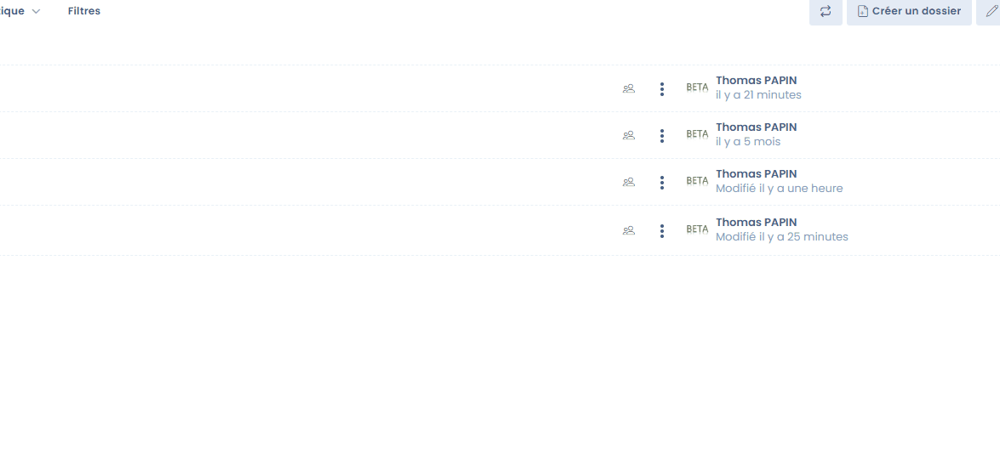

# Dokumentenmanagement (DMS)

Dastra integriert nativ eine Funktion für das Dokumentenmanagement.

Dieses Modul ermöglicht es, den Zugang zu allen in Dastra verknüpften Dokumenten zu zentralisieren und gemeinsam zu nutzen.

Hier können Sie beispielsweise alle nützliche Dokumentation zur Nachweisführung Ihrer DSGVO-Compliance ablegen.


**Fokus auf die DSGVO-Dokumentation**

Die Dokumentationspflicht ergibt sich aus dem **Grundsatz der Rechenschaftspflicht** (Accountability), der in Artikel 24 der DSGVO verankert ist.

Diese Dokumentation umfasst in der Praxis zunächst das Verarbeitungsverzeichnis, aber auch weitere Elemente der Datenverwaltung und DSGVO-Compliance. **Dabei kann es sich um folgende Elemente handeln (nicht abschließende Liste):**

* Interne Verfahren zur Erstellung einer neuen Verarbeitung personenbezogener Daten (interne Kontrolle, Risiko- und Verhältnismäßigkeitsbewertung usw.)
* Verfahren zur Durchführung von DSFA
* Einführung verbindlicher schriftlicher Datenschutzrichtlinien, die bei neuen Datenverarbeitungsvorgängen zu berücksichtigen und anzuwenden sind (z. B. Einhaltung von Datenqualitätskriterien, Vorabinformation, Sicherheitsgrundsätze, Konsultation usw.), die den betroffenen Personen zur Verfügung gestellt werden sollten
* Zuordnung der Verfahren zur ordnungsgemäßen Erfassung aller Datenverarbeitungsvorgänge und Verwaltung eines Verzeichnisses dieser Vorgänge
* Einführung von Schulungsprogrammen für die mit der Verwaltung von Datenverarbeitungen betrauten Personen
* Einführung von Verfahren zur Verwaltung von Auskunfts-, Berichtigungs- und Löschungsanträgen sowie der Rechte der betroffenen Personen an ihren Daten
* Einrichtung eines internen Beschwerdemanagements
* Ausarbeitung interner Verfahren für ein effizientes Management und eine effiziente Meldung von Datenschutzvorfällen
* Durchführung von Datenschutz-Folgenabschätzungen unter bestimmten Umständen
* Implementierung und Überwachung von Prüfverfahren, um sicherzustellen, dass alle Maßnahmen nicht nur auf dem Papier existieren, sondern auch in der Praxis umgesetzt werden und funktionieren (interne oder externe Audits usw.).

Sie können in diesem Bereich auch **alle nützlichen Dokumente zum Verständnis der Verarbeitungen, Schulungsunterlagen sowie gegebenenfalls Verträge zur Regelung der Verarbeitung ablegen**.


### Akzeptierte Formate

Zahlreiche Formate werden akzeptiert:

* pdf
* word
* excel
* jpg
* zip
* usw.

Wenn ein Format nicht akzeptiert wird, können Sie die Datei in ein .zip-Archiv packen, um sie in die Dokumentation aufzunehmen.

### Ein Dokument erstellen

Mit Dastra können Sie schnell ein Dokument für Notizen erstellen.

Gehen Sie dazu in das Dokumentenmanagement und klicken Sie auf "**Datei erstellen**"

<figure><figcaption>
Ein neues Dokument verfassen
</figcaption></figure>

Das neue Dokument wird im Markdown-Format (.md) gespeichert

<figure><figcaption></figcaption></figure>

### Einen Ordner erstellen

Sie können Ihre Dokumente in Ordnern organisieren, um sie leichter wiederzufinden.

Es ist möglich, Unterordner zu erstellen.

<figure><figcaption></figcaption></figure>

<figure><figcaption></figcaption></figure>

### Rechteverwaltung

Es ist möglich, Rechte für die Ordner und Dateien des DMS hinzuzufügen. Diese Rechte können sowohl für Ordner als auch für Dateien vergeben werden und können vom Administrator des Mandanten oder einem Nutzer mit der Berechtigung "Dateiverwaltung: Verwaltung" konfiguriert werden.


Wichtig: Standardmäßig werden keine Einschränkungen auf die Ordnerstruktur angewendet. Die mit den Rollen des Nutzers verbundenen Berechtigungen werden jedoch angewendet!


Der Eigentümer des Mandanten (oder Administrator) kann die Zugriffsrechte konfigurieren, indem er auf das Konfigurationssymbol in der entsprechenden Zeile klickt. Er kann dann die Zugriffe konfigurieren, indem er Teams und Nutzer mit der zugehörigen Ausführungsberechtigung hinzufügt.

<figure><figcaption>
Oberfläche zur Verwaltung der Berechtigungen
</figcaption></figure>

Diese Berechtigungen werden auf alle "Kind"-Elemente angewendet (d. h. alle Elemente, die in dem Ordner enthalten sind, was auch die Unterordner einschließt).


Ein Ordner, für den keine Berechtigung definiert ist, gilt als für alle Nutzer zugänglich.

Wenn Berechtigungen für ein Element definiert oder vererbt wurden, wird dieses für Nutzer ohne die erforderlichen Berechtigungen ausgeblendet.

