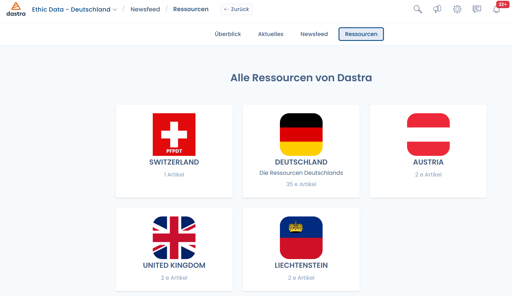
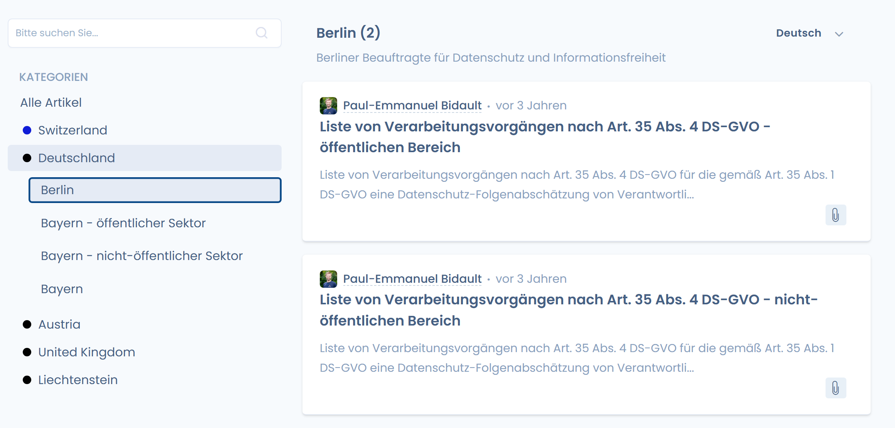
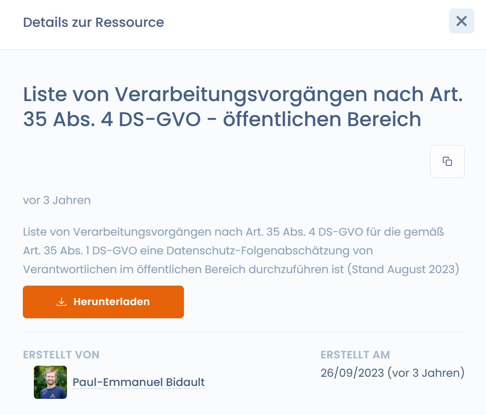

# Dokumentvorlagen

Sie suchen nach Dokumentvorlagen? Hier sind Sie richtig! :thumbsup:

Um auf die Dokumentressourcen zuzugreifen, navigieren Sie zum Modul "**Newsfeed**" und klicken Sie auf "**Ressourcen**"

<figure><figcaption>
Zugang zu den Ressourcen
</figcaption></figure>

Sie müssen nur noch die Vorlagen auswählen

<figure><figcaption></figcaption></figure>

Die Vorlagen stehen zum Download im Word-Format zur Verfügung.

<figure><figcaption>
Beispiele für Dokumentvorlagen
</figcaption></figure>
