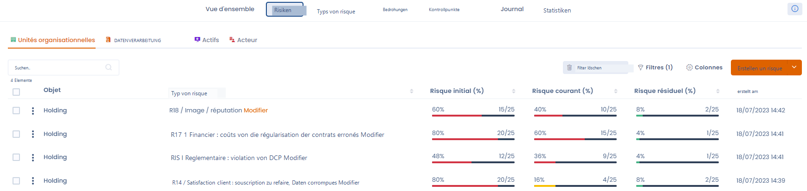

# Risikomanagement

Einleitung

Datenschutz, strategische Risiken, Nichteinhaltung, operationelle, finanzielle Risiken, Auftragsverarbeitung... Das Risikomanagement ist oft komplex und wenig effizient. Beseitigen Sie die Komplexität und verbessern Sie die Effizienz Ihrer Kontroll-, Audit- und Compliance-Pläne mit Dastra.

Erhalten Sie einen Gesamtüberblick über Ihre Risiken, um Ihre Maßnahmenpläne zu speisen, Ihre Abdeckung zu erweitern und Ihre Risikoexposition zu reduzieren. Rationalisieren Sie Ihre Bewertungs-, Kontroll-, Reporting- und Maßnahmenverfolgungsprozesse. Stellen Sie die Aktualisierung, Qualität und Verfügbarkeit Ihrer Risikodaten sicher.

## Das Risikomanagement in Dastra in wenigen Worten

Die Risikomanagement-Funktion der Lösung Dastra ermöglicht es, alle Ihre Risiken visuell und integriert zu identifizieren, zu bewerten, zu mindern und zu steuern sowie einen Gesamtüberblick über Ihre Risiken zu erhalten, um Ihre Maßnahmenpläne zu speisen, Ihre Abdeckung zu erweitern und Ihre Risikoexposition zu reduzieren.

Mit Dastra können Sie:

* **Ihre Risiken visualisieren** nach Verarbeitung, Asset oder Akteur;
* **Ihre Prozesse rationalisieren** für Bewertung, Kontrolle, Reporting und Verfolgung der Maßnahmenaufgaben;
* Die **Aktualisierung**, die **Qualität** und die **Verfügbarkeit** der Risikodaten sicherstellen. 

## Ein Risiko zuordnen

In Dastra kann ein Risiko **einem oder mehreren Objekten** zugeordnet werden, darunter die folgenden Elemente:

* Organisationseinheit
* Verarbeitung personenbezogener Daten
* Akteur oder Auftragsverarbeiter
* Asset

<figure><figcaption>
Beispiel einer konsolidierten Risikovisualisierung
</figcaption></figure>

## Weiterführende Informationen


[definition-des-risques.md](../../rappels-utiles/la-gestion-des-risques/definition-des-risques.md)



[evaluation-dun-risque.md](../../rappels-utiles/la-gestion-des-risques/evaluation-dun-risque.md)



[risques.md](risques.md)

