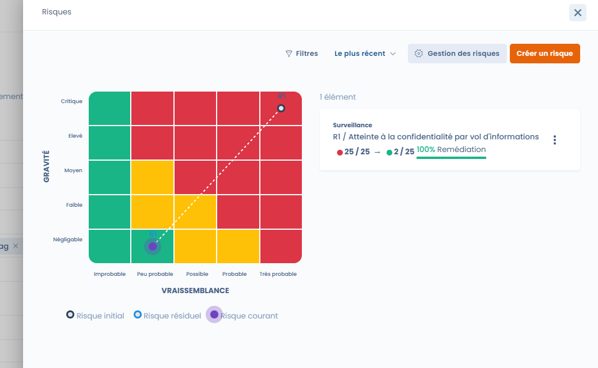

# Ein Risiko einer Verarbeitung zuordnen

### Ein Risiko in einer Verarbeitung hinzufügen&#x20;

Um ein Risiko zu einer Verarbeitung hinzuzufügen, gehen Sie auf den Reiter "Risiken" auf der Bearbeitungsseite der Verarbeitung.

<figure><figcaption></figcaption></figure>

und klicken Sie auf die Schaltfläche "Ein Risiko erstellen".

Sie gelangen auf eine Bearbeitungsseite des Risikos und können die Informationen zum identifizierten Risiko eingeben.

Anschließend können Sie alle Risiken Ihres Verzeichnisses im Risiko-Referenzsystem wiederfinden.

<figure><figcaption></figcaption></figure>

Sie können ein Risiko auch direkt aus dem Risikomanagement-Modul an eine Verarbeitung anhängen.&#x20;

Gehen Sie dazu auf den Reiter "Risiken" und klicken Sie auf "Ein Risiko erstellen".&#x20;

### Risiken einer Verarbeitung visualisieren

Um die Risiken der Verarbeitungen zu visualisieren, müssen Sie zum Risiko-Modul von Dastra navigieren.&#x20;

Sie müssen auf den Reiter "Risiken" gehen und erhalten eine Visualisierung aller Risiken, sortiert nach den mit jedem Risiko verknüpften Elementen.&#x20;

### Bewertung der Risikostufe

Die Risikostufe wird nach folgender Formel berechnet:

`Risikostufe = Wahrscheinlichkeitswert X Auswirkungswert`  

Im Dashboard zeigt ein Risiko-Modul die Anzahl der Risiken, die Verarbeitungen mit den höchsten Risiken, das Gesamtrisiko und die Stufe der Verarbeitung mit den meisten Risiken an.&#x20;

Das Gesamtrisiko wird nach folgender Formel berechnet: 

`Summe (Wahrscheinlichkeit * Auswirkung) / Anzahl der Risiken` 

Die Stufe der Verarbeitung mit dem höchsten Risiko wird nach folgender Formel berechnet: 

`((Auswirkung x Wahrscheinlichkeit) / 25)` 

## **Weiterführende Informationen**


[planifier](../planifier/)


