# Regelmäßige Überprüfung (Aktualität)

### Was ist der Aktualitätsindikator?

Die Aktualität ist ein Indikator für die letzte Überprüfung eines Elements in Dastra. Es kann sich um eine Verarbeitung, ein Objekt Ihres Referenzverzeichnisses oder sogar einen Vertrag handeln. Durch Aktivierung dieser Funktionalität legen Sie ein zukünftiges Überprüfungsdatum für das Objekt fest, und die Aktualität verschlechtert sich, je näher dieses Datum rückt. Diese Funktionalität ist ein einfaches und spielerisches Mittel, um sicherzustellen, dass Sie die in der Anwendung eingegebenen Informationen regelmäßig überprüfen.

<figure>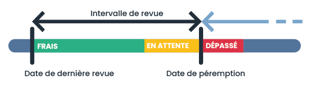<figcaption>
Funktionsschema des Aktualitätsindikators
</figcaption></figure>

### Wie aktiviere ich den Aktualitätsindikator?

Um die Aktualität für einen Objekttyp zu aktivieren, gehen Sie in die Einstellungen Ihres Mandanten und wählen Sie den Tab _Regelmäßige Überprüfungen_.

<figure>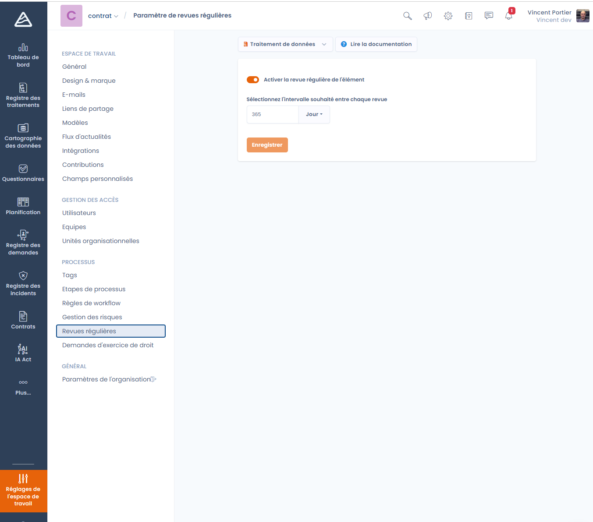<figcaption>
Das Konfigurationsmenü der regelmäßigen Überprüfung (Aktualität)
</figcaption></figure>

Sie können von diesem Menü aus die Aktualität für die verschiedenen Objekte aktivieren, die über diese Funktionalität verfügen, indem Sie auf das Dropdown-Menü zur Objektauswahl klicken.

<figure>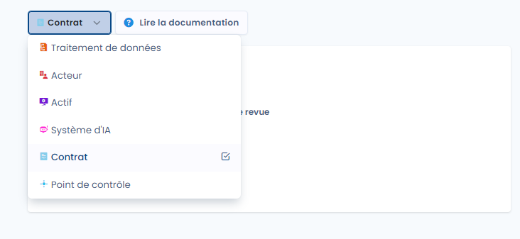<figcaption>
Die Liste der Objekte, für die Sie die Aktualität aktivieren können
</figcaption></figure>

Aktivieren Sie die Option „Regelmäßige Überprüfung des Elements aktivieren" und konfigurieren Sie **das gewünschte Zeitintervall zwischen jeder Überprüfung**.

Die Aktualität eines Elements entspricht der Anzahl der Tage zwischen dem letzten Datum, an dem das Element als aktuell markiert wurde, und seinem zukünftigen Überprüfungsdatum.

Das Überprüfungsdatum ist ein zukünftiges Datum, das berechnet wird, indem zum letzten Datum, an dem das Element als aktuell markiert wurde, **das gewünschte Zeitintervall zwischen jeder Überprüfung** hinzugefügt wird.

Bitte beachten Sie, dass dieses Ablaufintervall für alle Elemente desselben Typs gleich ist, für die die Überprüfung aktiv ist.

### Aktualitätsoption deaktivieren

Um die Option zu deaktivieren, müssen Sie einfach das Kontrollkästchen _Regelmäßige Überprüfung des Elements aktivieren_ im Bereich „Regelmäßige Überprüfungen" der Mandant-Einstellungen deaktivieren.

### Visualisierung des Aktualitätsindikators

Alle Objekte, die über diese Funktionalität verfügen, haben eine Spalte „Datum der letzten Überprüfung", die Sie den Übersichtstabellen hinzufügen können. Diese Spalte ermöglicht die Verfolgung des Aktualitätsstatus jedes Elements.

Bitte beachten Sie, dass die Aktualität nur für **veröffentlichte Elemente** angezeigt wird.

<figure>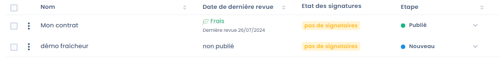<figcaption>
Die Spalte „Datum der letzten Überprüfung"
</figcaption></figure>

Diesen Indikator finden Sie auch im Schnellzugriffsmenü der Elemente.

<figure>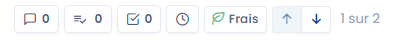<figcaption>
Der Aktualitätsindikator im Schnellzugriffsmenü eines Elements
</figcaption></figure>

### Visualisierung des Aktualitätsindikators im spezifischen Fall des Verarbeitungsverzeichnisses

Die Anzeige der Aktualität im Rahmen einer Datenverarbeitung ist etwas umfangreicher als bei den anderen Elementen, die über diese Funktionalität verfügen.

Sie finden den Aktualitätsindikator oben rechts in Ihrem Verarbeitungsformular (sofern die Verarbeitung veröffentlicht und mindestens einmal als aktuell markiert wurde)

Dieser Indikator besteht aus einem Label mit den Werten „Aktuell", „Ausstehend" und „Überfällig", einer Farbe (jeweils Grün, Gelb, Rot), einem Fortschrittsbalken, der abnimmt, je näher das Ablaufdatum rückt, einer Schaltfläche zum Markieren der Verarbeitung als aktuell und der Anzahl der verbleibenden Tage oder der Verzögerung gegenüber dem Ablaufdatum.

<figure>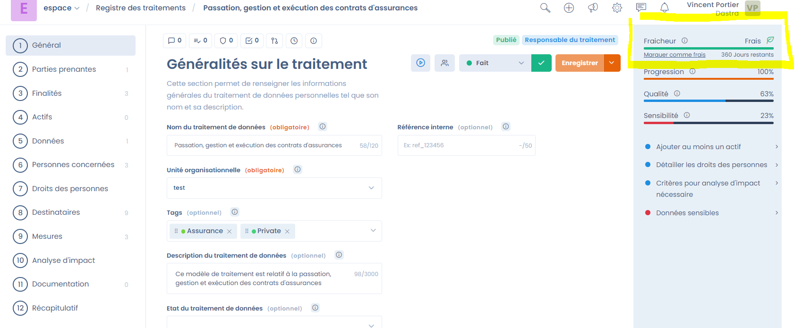<figcaption></figcaption></figure>

<figure>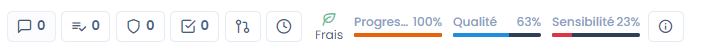<figcaption>
In der mobilen Ansicht finden Sie diesen Indikator ebenfalls in der Navigationsleiste oben in Ihrem Verarbeitungsformular
</figcaption></figure>

<figure>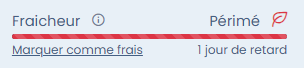<figcaption>
Beispiel einer abgelaufenen Verarbeitung
</figcaption></figure>

### Anzeigeregeln für Überprüfungsstatus

Es gibt 3 mögliche Status bezüglich der Aktualität einer Verarbeitung: aktuell, ausstehend oder überfällig. Standardmäßig gelten die folgenden Anzeigeregeln:

<table><thead><tr><th width="258">Überprüfungsstatus</th><th>Anzeigeregel</th></tr></thead><tbody><tr><td>Aktuell (grüne Farbe)</td><td>
Das Element wurde kürzlich überprüft und erfordert keine sofortige Aufmerksamkeit.

 Dieser Status wird angezeigt, bis das aktuelle Datum in den letzten 10 Prozent des vorgesehenen Intervalls seit der letzten Überprüfung liegt.
</td></tr><tr><td>Ausstehend (orange Farbe)</td><td>
Das Element muss überprüft werden. 

Dieser Status wird in den letzten zehn Prozent des vorgesehenen Intervalls seit der letzten Überprüfung angezeigt.
</td></tr><tr><td>Überfällig (rote Farbe)</td><td>Das Element entspricht nicht mehr der Überprüfungsrichtlinie.  Dieser Status wird angezeigt, wenn das aktuelle Datum größer ist als das Datum der letzten Überprüfung + das definierte Intervall.</td></tr></tbody></table>


**Beispiel:**

Ich habe ein Intervall von 1 Jahr für die Überprüfung der Verarbeitungen festgelegt. Für eine am 1. Januar überprüfte Verarbeitung:

* wird sie bis zum 25. November als aktuell angezeigt
* wird sie ab dem 25. November als ausstehend angezeigt
* Am 31. Dezember wird sie dann als überfällig angezeigt, solange sie nicht überprüft wird.


### Ein Element aktualisieren

Sie können jederzeit, ohne unbedingt das nächste Überprüfungsdatum abzuwarten, entscheiden, das Element zu überprüfen. Klicken Sie dazu auf die Zelle der Spalte „Datum der letzten Überprüfung" eines Elements, wenn Sie sich in einer Tabellenansicht befinden. Die Funktionalität muss natürlich für dieses Element aktiv sein und Sie müssen die betreffende Spalte anzeigen.

<figure>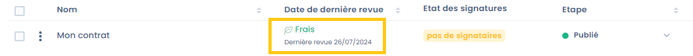<figcaption>
Zugang zum Fenster der regelmäßigen Überprüfung des Elements
</figcaption></figure>

Sie können auch direkt über die Bearbeitungsansicht des zu überprüfenden Elements darauf zugreifen, indem Sie auf das Aktualitätssymbol im Schnellzugriffsmenü klicken.

<figure>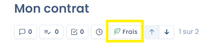<figcaption>
Das Aktualitätssymbol, auf das Sie klicken, um zur Überprüfung eines Elements zu gelangen.
</figcaption></figure>

Sie gelangen dann zum Überprüfungsfenster des Elements. Beachten Sie, dass es möglich ist, frühere Überprüfungen über dieses Fenster einzusehen.

<figure>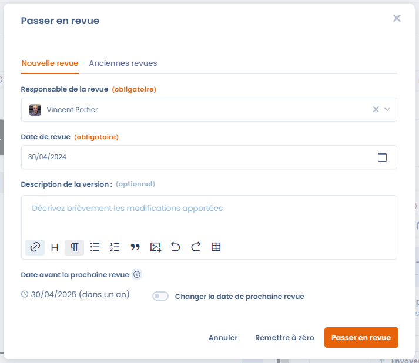<figcaption>
Das Fenster zur Überprüfung eines Elements
</figcaption></figure>

Durch die Überprüfung eines Elements starten Sie einen neuen Aktualitätszyklus ab dem aktuellen Datum bis zum nächsten Überprüfungsdatum. Das Überprüfungsdatum wird standardmäßig basierend auf der Einstellung des Überprüfungsintervalls des Elements berechnet (siehe oben). Sie können dieses Standarddatum ignorieren und ein spezifisches Ablaufdatum für dieses Element festlegen, indem Sie die Option „Nächstes Überprüfungsdatum ändern" aktivieren und ein neues Datum auswählen (das nächste Überprüfungsdatum muss mindestens auf T+1 festgelegt werden)

### Benachrichtigungen

Der Ersteller des Elements sowie die mit dem Element verknüpften Nutzer (zum Beispiel die Inhaber bei Verarbeitungen) werden beim Übergang in den abgelaufenen Status per E-Mail benachrichtigt, um sie daran zu erinnern, dass das Element seit langem nicht überprüft wurde und es Zeit ist, es zu aktualisieren.
