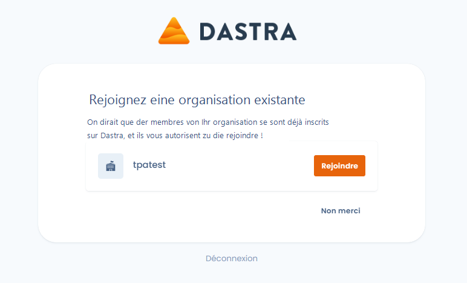

# E-Mail-Domains

## Wozu dienen sie?

Die E-Mail-Domains ermöglichen Ihren zukünftigen Mitarbeitern die Möglichkeit, direkt einem Mandanten mit der gewählten Rolle zugewiesen zu werden, ohne dass Sie handeln müssen.

## Wie verwende ich sie?

Die Konfiguration der E-Mail-Domains finden Sie in der allgemeinen Konfiguration Ihrer Organisation, Bereich **Sicherheit**

<figure><figcaption>
E-Mail-Domains Konfiguration
</figcaption></figure>

Aktivieren oder deaktivieren Sie die Funktionalität, indem Sie auf die Schaltfläche „_Nutzern erlauben_..." klicken

Wählen Sie dann die Rolle und den Mandanten aus, die zukünftigen Nutzern zugewiesen werden:

<figure><figcaption>
Zuweisung der Rolle und des Mandanten
</figcaption></figure>

Speichern Sie abschließend die Konfiguration, indem Sie auf die Schaltfläche _Speichern_ klicken!


**Einschränkungen**:

Sie dürfen nur E-Mail-Domains hinzufügen, die zuvor autorisiert wurden (d. h. für die ein Nutzer Ihrer Organisation eine E-Mail-Adresse validiert hat).

Persönliche Domains (gmail, hotmail usw.) oder als „Wegwerf"-Domains identifizierte Domains sind verboten!


## Auswirkung für zukünftige Nutzer

Beim nächsten Mal, wenn sich ein Mitarbeiter bei Dastra registriert, muss er weiterhin seine E-Mail-Adresse eingeben und validieren. Jedoch wird ihm nun vorgeschlagen, Ihrer Organisation beizutreten!

<figure><figcaption></figcaption></figure>

Er kann dann beitreten und mit Ihnen zusammenarbeiten!
