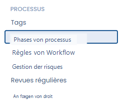

# Prozessschritte


**Prozessschritte vs. Workflow-Regeln**

Die Prozessschritte definieren die Status, die Objekte durchlaufen. Um Aktionen bei Schrittänderungen zu automatisieren (eine Benachrichtigung senden, eine Aufgabe erstellen…), konsultieren Sie die [Workflow-Regeln](workflow-rules.md).


## Wozu dienen Prozessschritte?

Die Workflow-Schritte ermöglichen es, einen Realisierungsprozess zu materialisieren, indem man von einem Schritt zum nächsten übergeht.&#x20;

So können Sie Ihr Verfahren sehr operativ umsetzen, indem Sie die zu befolgenden Schritte direkt in Dastra angeben.

## Wie passe ich die Workflow-Schritte an?



Klicken Sie auf „Einstellungen" und dann auf „Prozessschritte"&#x20;

<figure><figcaption></figcaption></figure>

Sie erhalten Zugriff auf die verschiedenen Schritte und Status („Entwurf" oder „Veröffentlicht") der pro Prozess verfügbaren Workflows. Passen Sie diese nach Ihren Wünschen an und klicken Sie auf „Speichern".

<figure><figcaption></figcaption></figure>

## Kann man einen Workflow-Schritt löschen?

Um Schritte zu löschen, klicken Sie auf den Papierkorb.&#x20;

Die an den gelöschten Schritt angehängten Elemente werden automatisch dem ersten Schritt im selben Status zugeordnet.&#x20;

Wenn Sie zum Beispiel den Schritt „In Bearbeitung" in den Aufgaben-Workflows löschen:

<figure><figcaption></figcaption></figure>

Werden die angehängten Objekte auf den Schritt „Info benötigt" verschoben:

<figure><figcaption></figcaption></figure>
