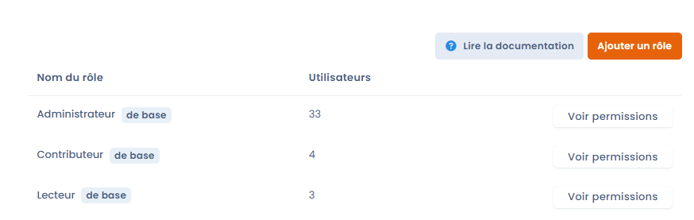
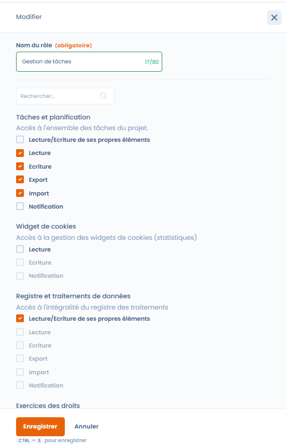

# Rollen und Berechtigungen

## Allgemeine Funktionsweise

Jeder Nutzer kann einer oder mehreren Rollen zugeordnet werden. Die Rollen sind ihrerseits mit einer Liste von Berechtigungen verknüpft (z. B.: im Verzeichnis schreiben, einen Fragebogen erstellen...). Es gibt zwei Möglichkeiten, die den Nutzern zugeordneten Rollen zu verwalten.&#x20;

* Wenn Sie Inhaber sind, können Sie [diese Kontoverwaltungsoberfläche](https://app.dastra.eu/general-settings/users) verwenden
* Wenn Sie die Rolle eines Mandanten-Administrators haben, können Sie die Rollen und Berechtigungen der Nutzer Ihres Mandanten über [diese Oberfläche](https://app.dastra.eu/workspace/573/settings/users) verwalten.&#x20;

## Erstellen Sie Ihre eigenen Rollen

Um Ihre eigenen Rollen mit zugehörigen Berechtigungen zu erstellen, gehen Sie auf [diese Seite](https://app.dastra.eu/general-settings/roles):

Sie können eine neue benutzerdefinierte Rolle erstellen, indem Sie auf die Schaltfläche „Rolle hinzufügen" klicken

<figure><figcaption></figcaption></figure>

Es ist dann möglich, die den Berechtigungen zugeordneten Kontrollkästchen auszuwählen:

<figure><figcaption>
Erstellung einer Aufgabenverwaltungsrolle
</figcaption></figure>

 

* **Lesen/Schreiben eigener Elemente:** Ermöglicht Nutzern, nur die ihnen zugewiesenen Elemente im Modul zu sehen und zu bearbeiten.
* **Lesen:** Ermöglicht Nutzern, alle Elemente des Moduls zu sehen.
* **Schreiben:** Ermöglicht Nutzern, alle Elemente des Moduls zu bearbeiten.
* **Export:** Ermöglicht Nutzern, alle Elemente des Moduls zu exportieren.
* **Import:** Ermöglicht Nutzern, alle Elemente in das Modul zu importieren.
* **Benachrichtigung:** Die Nutzer erhalten Benachrichtigungen für alle Elemente des Moduls.


Es ist nicht möglich, gleichzeitig „Lesen/Schreiben eigener Elemente" und die Berechtigungen für alle Elemente für dieselbe Rolle in einem Modul auszuwählen. Die Nutzer können entweder nur auf ihre eigenen Elemente oder auf alle Elemente zugreifen.


\
Sobald Ihre benutzerdefinierte Rolle erstellt ist, können Sie sie jedem Nutzer des Mandanten innerhalb Ihrer Organisation zuweisen.
