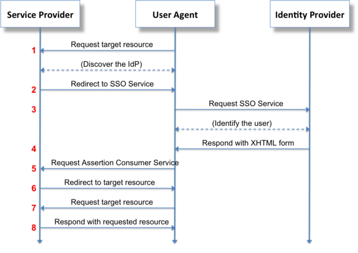
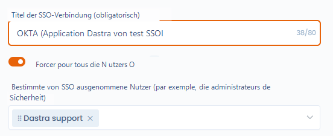
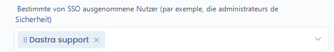
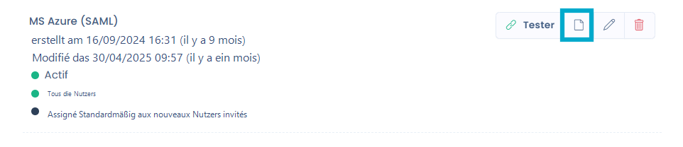
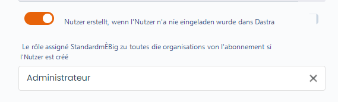
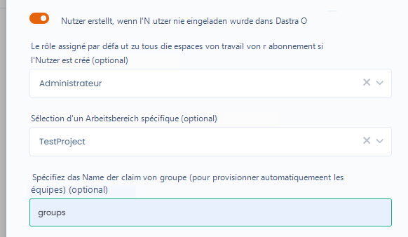
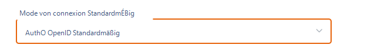

# Single Sign On (SSO)

## Funktionsprinzip

Die **einmalige Anmeldung**, oft mit dem englischen Kürzel **SSO** (Single Sign-On) bezeichnet, ist eine Methode, die es einem Nutzer ermöglicht, auf mehrere Computeranwendungen (oder gesicherte Websites) zuzugreifen, indem er sich nur einmal authentifiziert.

Das Unternehmen kann **sein eigenes Authentifizierungssystem** anstelle der von Dastra standardmäßig angebotenen lokalen Anmeldung verwenden. Zu den am häufigsten verwendeten SSO-Systemen gehören Microsoft Active Directory, Google Workspace (ehemals GSuite), Auth0 usw.

**Die Funktionsweise ist wie folgt:**

Ein Nutzer (**User Agent**) fordert eine Verbindung beim Dienstanbieter (**Service Provider**) an, der sich an einen Identitätsanbieter (**Identity Provider**) wendet, der den Nutzer authentifiziert. Diese Authentifizierung wird dann an den Dienstanbieter zurückgesendet, der die Verbindungsanfrage des Nutzers akzeptiert.

In unserem Fall ist der User Agent der **Browser eines Dastra-Nutzers**. Der Service Provider ist **Dastra** und der Identity Provider ist Ihr **bevorzugter Authentifizierungsanbieter** (zum Beispiel: Active Directory).



## Einrichtung

Innerhalb eines Dastra-Abonnements haben Sie die Möglichkeit, wenn Sie die Funktionalität abonniert haben, ein oder mehrere SSO-Logins zu verwalten. Um auf die SSO-Konfiguration zuzugreifen, gehen Sie auf [die Konfigurationsseite für SSO-Logins](https://app.dastra.eu/general-settings/sso) im Sicherheits-Tab des Konfigurationspanels des Abonnementkontos.


**Achtung**: Sie müssen Inhaber der Organisation sein, um auf diese Seite zugreifen zu können.


Dastra bietet zwei Protokolle für die einmalige Anmeldung an: [**SAML 2**](saml-2.md) und [**Open ID**](openid.md). Um auf die Konfigurationshilfe zuzugreifen, klicken Sie auf die folgenden Links.


[saml-2.md](saml-2.md)



[openid.md](openid.md)



[adfs.md](adfs.md)


## Wie aktiviere ich das SSO für alle Nutzer Ihrer Organisation?

### Einrichtung:

* Klicken Sie auf Ihre SSO-Konfiguration
* Aktivieren Sie das Kontrollkästchen „Für alle Nutzer erzwingen"

<figure><figcaption></figcaption></figure>

### Verwaltung von SSO-Login befreiten Nutzern

In bestimmten Fällen möchten Sie **das SSO für bestimmte Nutzer deaktivieren** (zum Beispiel ein Sicherheitsadministrator, ein Dienstkonto, ein Nutzer, der sich nicht in Ihrem Active Directory befindet...). In diesem Fall ist es möglich, spezifische Nutzer anzugeben, die nicht zum SSO-Login Ihrer Organisation weitergeleitet werden. Es wird empfohlen, einen Nutzer mit einem lokalen Dienstkonto zu benennen, um Fehlfunktionen des SSO zu handhaben, beispielsweise bei einem Ausfall des Identitätsanbieters oder einem Konfigurationsproblem.

Diese Nutzer können sich mit **ihrem Passwort** bei der Anwendung anmelden.

Sie können vom SSO befreite Nutzer benennen, indem Sie die Nutzer Ihrer Organisation im folgenden Feld auswählen:

<figure><figcaption></figcaption></figure>

## Wie aktiviere ich die automatische Nutzerbereitstellung?

Wenn Sie möchten, dass die Nutzer Ihres Identitätsanbieters keine Konten erstellen müssen, um auf die Einheit zuzugreifen, können Sie das Kontrollkästchen „Automatische Nutzerbereitstellung" aktivieren. Wenn Sie Ihren Nutzern eine SSO-Anbieter-URL wie diese bereitstellen:

```
https://account.dastra.eu/account/loginexternal?
provider={id de votre provider}&
returnUrl=https://www.dastra.eu 
```

Sie können diesen Link abrufen, indem Sie auf diese Schaltfläche klicken:<br>

<figure><figcaption></figcaption></figure>

<figure><figcaption></figcaption></figure>

Im Fall einer validierten Authentifizierung wird automatisch ein Konto in Dastra erstellt und eine Benachrichtigungs-E-Mail wird Ihnen einige Stunden später zugesendet.

Die automatische Bereitstellung funktioniert nur, wenn dieser Link an die Nutzer weitergegeben wird; sie können dies nicht über die klassische Anmeldeseite tun.


Wenn das Konto des Nutzers im Authentifizierungsanbieter gelöscht oder ungültig gemacht wird, wird sein Konto in Dastra nicht gelöscht, er kann sich jedoch nicht mehr anmelden. Sie haben die Möglichkeit, diese Konten [über den Nutzermanager des Abonnements](https://app.dastra.eu/general-settings/users) zu bereinigen.


Sie können **die standardmäßig zugewiesene Rolle** für alle mit Ihrem Abonnement verknüpften Organisationen wählen.




Derzeit unterstützt Dastra nicht das Binding von Rollen über die Eigenschaften des Authentifizierungsservers. Wenn diese Funktionalität wichtig ist, können Sie uns dies über die [Support-Seite](https://app.dastra.eu/general-settings/support) mitteilen.


### Team-Binding

Es ist möglich, die Teams eines Mandanten an eine Eigenschaft (Claim) zu binden, die von Ihrem Authentifizierungsserver zurückgegeben wird.

<figure><figcaption></figcaption></figure>

## Wie verwalte ich die Logins der Nutzer?

Sie können den Login-Typ der Nutzer konfigurieren, indem Sie die [Nutzerverwaltungsseite des Abonnements](https://app.dastra.eu/general-settings/users) aufrufen. Wenn Sie ein Nutzerprofil aufrufen, können Sie den bevorzugten SSO-Login auswählen. Sobald der Nutzer sich mit seiner E-Mail-Adresse bei Dastra anmeldet, wird er automatisch zur Login-Seite des von Ihnen eingerichteten Authentifizierungsanbieters weitergeleitet.



Sie können den Login-Typ auch bei der Einladung neuer Nutzer festlegen.

### Was tun, wenn ich mich nicht per SSO anmelden kann?

Kontaktieren Sie sofort [den Support](../../../getting-started/le-support/faire-une-demande-de-support.md)
