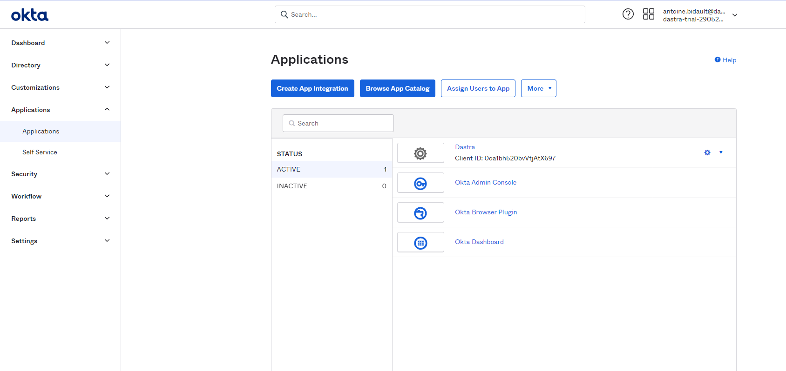
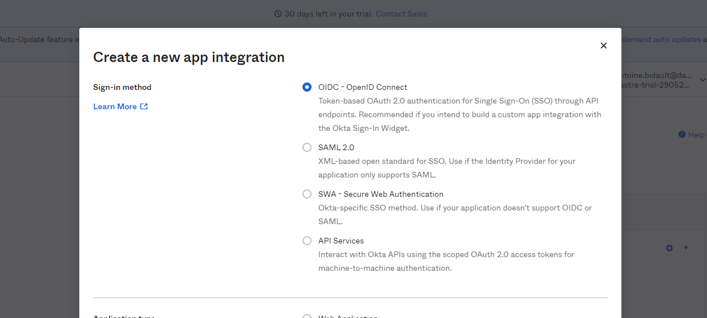
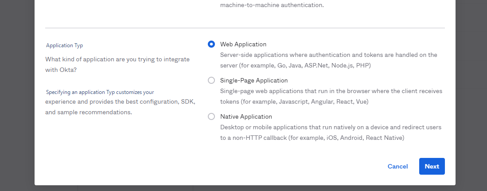
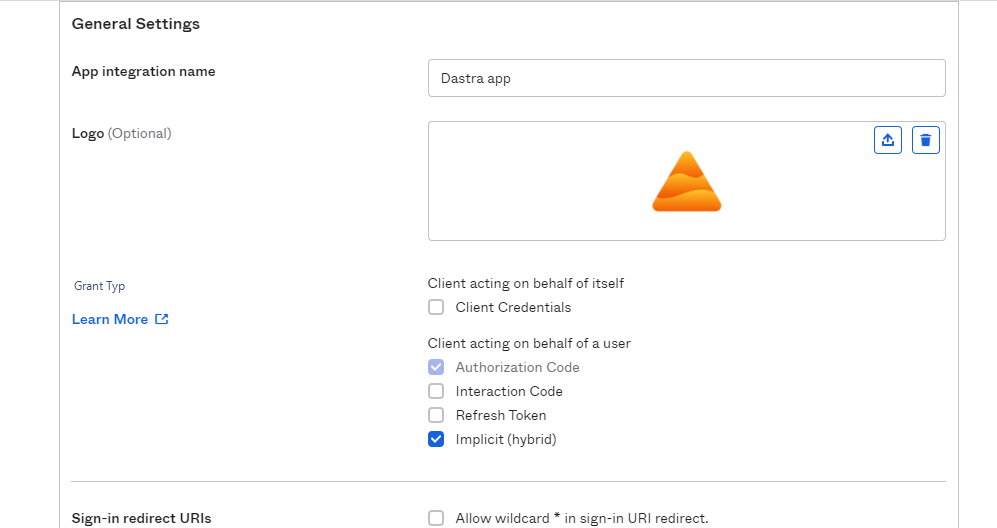
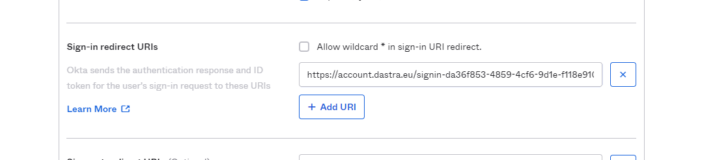
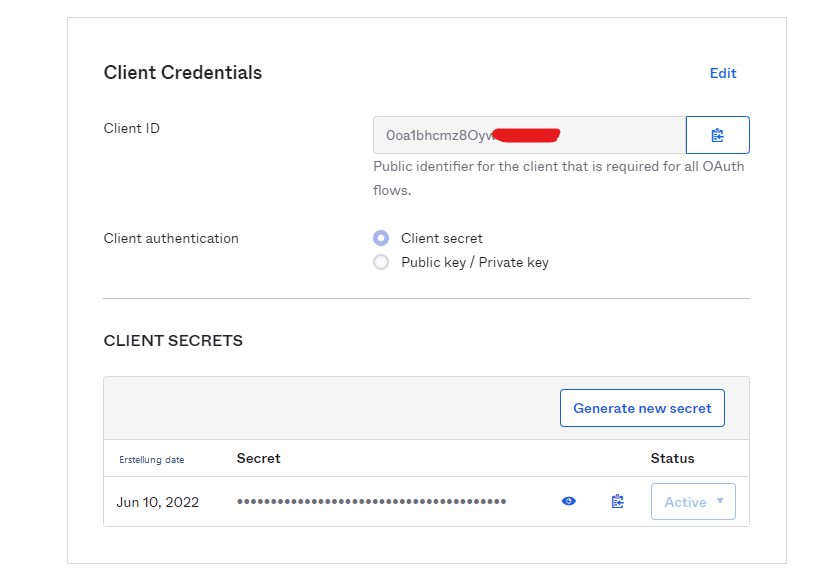
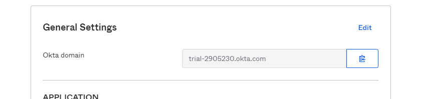
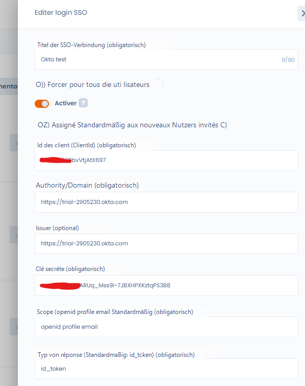

# Okta

So konfigurieren Sie den Okta-Login als SSO in Dastra unter Verwendung des Protokolls **OpenId Connect**. Hinweis: Dies ist auch mit SAML möglich.

**Schritt 1**: Gehen Sie zum **Okta-Administrator-Backoffice**

**Schritt 2:** Gehen Sie zum Menü **„Applications" > „Applications"**. Klicken Sie auf die Schaltfläche **„Create App Integration"**

**Schritt 3**: Wählen Sie „**OIDC - OpenID Connect**"

**Schritt 3**: Wählen Sie den Anwendungstyp „**Web application**"

**Schritt 4**: Konfigurieren Sie die Anwendung wie folgt und aktivieren Sie dabei das Kontrollkästchen „**Implicit**"

Für das Anwendungslogo können Sie [dieses hier verwenden](https://www.dastra.eu/img/press/logodastra.png)

**Schritt 5**: An dieser Stelle müssen Sie eine Umleitungs-URL von _Dastra_ in Ihrer _Okta_-Anwendung konfigurieren. Gehen Sie dazu zurück in die _Dastra_-Anwendung, [auf die SSO-Verwaltungsseite](https://app.dastra.eu/general-settings/sso). Klicken Sie auf „**Neuer SSO-Login**", und unten im Formular wird eine Umleitungs-URL angezeigt, die Sie kopieren müssen.

<figure><figcaption></figcaption></figure>

**Schritt 6**: Gehen Sie zurück zu Okta und fügen Sie die Umleitungs-URL in das entsprechende Feld ein, wählen Sie die Okta-Nutzer aus, denen Sie Zugang zu Dastra gewähren möchten (standardmäßig können Sie „Allow everyone" aktivieren) und klicken Sie auf „**Save**"

**Schritt 7**: Fast geschafft! Sie werden auf eine Seite mit allen Einstellungen der neuen SSO-App weitergeleitet: Client-ID, Geheimer Schlüssel und Domain/Authority.

**Schritt 8**: Gehen Sie zurück zu **Dastra**. Sie können die Formularfelder wie folgt ausfüllen:&#x20;

* **Client-ID**: Kopieren Sie die Client-ID von Okta&#x20;
* **Authority/Domain**: **Achtung!** Die Domain mit dem Protokoll angeben (https://\*\*\*.okta.com).
* **Issuer**: leer lassen!&#x20;
* **Geheimer Schlüssel**: Kopieren Sie den geheimen Schlüssel von Okta
* **Scope**: openid profile email &#x20;
* **Response-Typ**: id\_token

**Schritt 8**: Klicken Sie auf „**Speichern**" => Starten Sie dann einen Test, indem Sie auf die Schaltfläche „Testen" klicken! Wenn Sie erfolgreich zu Dastra weitergeleitet werden, haben Sie es geschafft! :tada:

