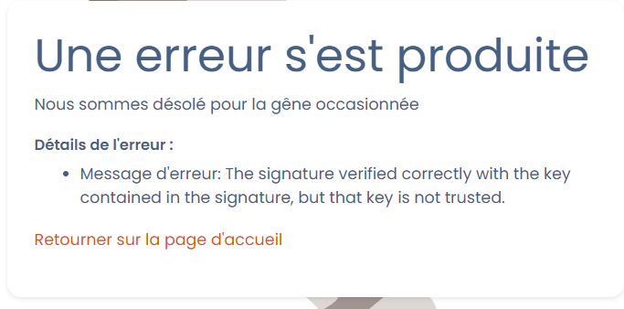

# Bekannte Probleme

## Der Nutzer wird vom SSO nicht erkannt

Mehrere Gründe können Fehler bei der SSO-Verbindung eines Nutzers verursachen.&#x20;

Wenn ein Fehler anzeigt, dass der Nutzer nicht auf die Anwendung zugreifen kann, stellen Sie Folgendes sicher:&#x20;

* Haben Sie überprüft, dass die SSO-Konfiguration keinen Fehler aufweist? Sie können sich vergewissern, indem Sie auf die Schaltfläche „Testen" bei der Verbindung klicken. Wenn es funktioniert, ist die Konfiguration korrekt. Andernfalls hat sich ein Fehler in die Konfiguration eingeschlichen.&#x20;
* Ist der Nutzer der Organisation zugeordnet? Der Nutzer muss in der Nutzerliste der Organisation vorhanden sein. Das SSO ist nämlich mit der Organisation verknüpft.&#x20;
* Wenn der Nutzer bereits ein Nutzerkonto erstellt hat (zum Beispiel in einer anderen Organisation oder im Rahmen eines Testkontos), stellen Sie sicher, dass die Organisation, in der Sie das SSO konfiguriert haben, seine Hauptorganisation ist (gehen Sie dazu zur [Nutzerliste der Organisation](https://app.dastra.eu/general-settings/users)). Der Nutzer muss als interner Nutzer aufgeführt sein. Wenn dies nicht der Fall ist, bedeutet es, dass eine andere Organisation seine Verbindung zu Dastra verwaltet (seine Hauptorganisation), er wird dann als externer Nutzer angezeigt.&#x20;
* Wenn der Nutzer noch nie ein Konto erstellt hat&#x20;

## Fehlermeldung

Sie erhalten eine Fehlermeldung dieser Art:

<figure><figcaption></figcaption></figure>

1. Stellen Sie sicher, dass Sie ein gültiges Zertifikat haben.
2. Überprüfen Sie, dass beim Kopieren/Einfügen des Zertifikats keine Zeilenumbrüche oder Leerzeichen eingefügt wurden
