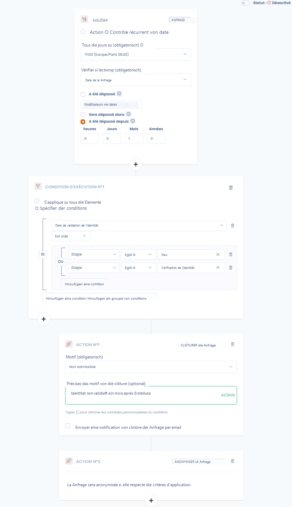
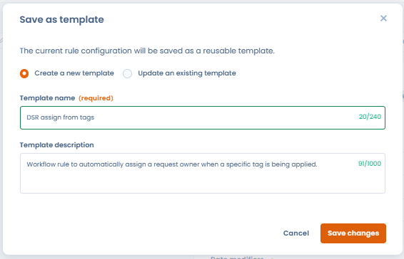

# Workflow-Regeln


**Prozessschritte vs. Workflow-Regeln**

Die [Prozessschritte](etapes-de-processus.md) definieren die Status, die Objekte durchlaufen (z. B. Neu → In Bearbeitung → Erledigt). Die **Workflow-Regeln** automatisieren Aktionen, wenn diese Schritte oder andere Ereignisse eintreten. Beide Funktionen ergänzen sich.


## Das Funktionsprinzip

Die Workflow-Regeln in Dastra sind eine Reihe von Aktionen (E-Mail-Benachrichtigungen, Planung eines Audits, Aufgaben und Feldaktualisierungen), die ausgeführt werden, wenn bestimmte Bedingungen erfüllt sind. Diese Regeln automatisieren den Prozess des Versendens von E-Mail-Benachrichtigungen, der Aufgabenzuweisung und der Aktualisierung bestimmter Felder eines Datensatzes, wenn eine Regel ausgelöst wird.

 (1).png>)


Die Anzahl der verfügbaren Workflow-Regeln hängt von Ihrem Plan ab, **von 25 bis 100 Regeln**. Eine zusätzliche Kapazität kann bei Bedarf erworben werden. Kontaktieren Sie Ihren Account Manager für weitere Details.


## Wie erstelle ich eine Workflow-Regel in Dastra?

* Gehen Sie auf [die Konfigurationsseite der Workflow-Regeln Ihres Mandanten](https://app.dastra.eu/workspace/0/settings/workflow-rules)
* Klicken Sie auf „Neue Workflow-Regel"
* Wählen Sie einen Namen und den betroffenen Entitätstyp (Verarbeitung, Verletzungen...)
* Sie gelangen in den Regel-Designer

### Definition des Auslösers

Sie können eine Workflow-Regel durch zwei Ereignisse auslösen:&#x20;

* Bei **einer Aktion auf eine betroffene Entität**: Erstellung, Änderung, Schrittänderung oder Verschiebung in den Papierkorb (nur für Objekte, bei denen der Papierkorb existiert)

<figure><figcaption><p>Erstellung eines aktionsbasierten Auslösers</p></figcaption></figure>

* **Wiederkehrende Datumsprüfung** — die Regel wird täglich zu einer konfigurierten Uhrzeit ausgewertet und wird in Abhängigkeit eines Datumsfeldes des Objekts ausgelöst. Konfigurieren Sie die folgenden Parameter:
  * **Täglich ausführen um** — die Uhrzeit der täglichen Prüfung (mit Zeitzonen-Verwaltung, z. B. 00:00 Europe/Paris).
  * **Zu prüfendes Datumsfeld** — das auszuwertende Datumsfeld (z. B. Abschlussdatum, Erstellungsdatum, Überprüfungsdatum…).
  * **Bedingung für das Datum** — wählen Sie aus:
    * **Wurde überschritten** — löst am Tag aus, an dem das Datum erreicht wird.
    * **Datumsmodifikatoren** — fügen Sie einen Offset zum Datum hinzu:
      * **Wird eintreten in** — löst N Stunden / Tage / Monate / Jahre *vor* dem Datum aus (z. B. 30 Tage vor Vertragsablauf).
      * **Wurde überschritten seit** — löst N Stunden / Tage / Monate / Jahre *nach* dem Datum aus (z. B. 1 Tag nach Abschluss).

  Die Schaltfläche **„Elemente anzeigen, als wäre es heute"** ermöglicht die Vorschau der Objekte, die aktuell der Regel entsprechen würden, nützlich zum Testen vor der Aktivierung.

<figure><figcaption></figcaption></figure>

Pro Workflow-Regel kann nur ein Auslöser (oder Trigger) definiert werden.

Beachten Sie, dass Sie wählen können, ob der Workflow mehr als einmal pro Entität ausgeführt werden kann. **Es wird dringend empfohlen, Workflows nur einmal pro Entität auszuführen**, da die mehrfache Ausführung eines Workflows leicht zu Problemen mit wiederholter Aufgabenerstellung oder doppelten Benachrichtigungen führen kann.

### Definition von Bedingungen

Sie können eine oder mehrere Ausführungsbedingungen pro Regel konfigurieren.

Die Bedingungen können auf alle Felder des Objekts angewendet werden und können innerhalb von Gruppen zusammengefasst werden, um Ihnen die Umsetzung aller möglichen Szenarien zu ermöglichen (mit der Möglichkeit, die Verknüpfung „Und" oder „Oder" zu ändern).

<figure><figcaption><p>Hier wird die Aktion ausgelöst, wenn der Schritt „Identitätsvalidierung" oder „Neu" ist UND das E-Mail-Validierungsdatum ausgefüllt ist</p></figcaption></figure>

### Definition der Aktionen

Um eine neue Aktion hinzuzufügen, klicken Sie auf die Schaltfläche „**Aktion hinzufügen**" und wählen Sie die gewünschte Vorlage

Hier sind die **verschiedenen Aktionstypen**, die Sie auslösen können:&#x20;

* Versand einer E-Mail-Benachrichtigung
* Aktualisierung eines Feldes der betroffenen Entität
* Hinzufügen eines Tags zur Entität
* Automatische Planung einer Fragebogenantwort
* Festlegung der zugewiesenen Person
* Automatische Aufgabenerstellung

Für Rechteausübungsanfragen stehen zusätzliche Aktionen zur Verfügung:

* Anfrage schließen
* Anfrage in den Papierkorb verschieben
* Anonymisierung der Anfrage (nur möglich, wenn die Anfrage geschlossen ist)

Es ist möglich, Bedingungen zu verketten. Sie können mehrere Aktionen pro Bedingung hinzufügen, indem Sie erneut auf „Aktion hinzufügen" klicken.


Beispiel: Eine Benachrichtigung an mehrere Personen bei der Erstellung einer Aufgabe senden. Wählen Sie dazu den Auslöser „Aufgaben" und je nach Aufgabenbedingungen (zum Beispiel das Hinzufügen eines Tags) eine Aktion „Benachrichtigung" hinzufügen


### Benutzerdefinierte Variablen

\
**Beispiel**

Um eine Variable vom Typ Zeichenkette anzuzeigen (die Referenz einer Verarbeitung)

Sehr oft ist es in benutzerdefinierten Benachrichtigungen zum Beispiel interessant, Informationen aus dem Objekt einzufügen, das in den Workflow eingetreten ist: der Name der Verarbeitung, ihr Veröffentlichungsdatum... sind alles Variablen, die Sie dank des Variableninjektionssystems einfach in den Text Ihrer Benachrichtigungen einfügen können.

Intern verwendet Dastra eine Templating-Engine basierend auf [LiquidJS](https://shopify.github.io/liquid/basics/introduction/)

**Um auf die verschiedenen Variablen des Trigger-Objekts zuzugreifen, tippen Sie "\{{",** dies zeigt eine Liste von Variablenvorschlägen an, die Sie in den Inhalt einfügen können

```
{{ref}}
```

Um alle Werte einer Variablen vom Typ Array anzuzeigen (die Tags)

```


 {{ tag.label }}


```

Um nur den ersten Wert einer Variablen vom Typ Array anzuzeigen (erster Genehmiger einer Verarbeitung)

```


{{accountable.displayName}}
```


### Beispiele&#x20;

**Beispiel eines aktionsbasierten Workflows**

Dieses Beispiel zeigt die Verwendung eines aktionsbasierten Workflows, der die Genehmiger einer Verarbeitung bei einem Schrittänderung benachrichtigt, wenn der aktuelle Schritt nicht „Neu" ist

<figure><figcaption></figcaption></figure>

**Beispiel eines „komplexen" datumsbasierten Workflows:**

Dieses Beispiel zeigt die Verwendung eines datumsbasierten Workflows, der automatisch Rechteausübungsanfragen bereinigt, bei denen die Identität des Nutzers einen Monat nach der Erstellung nicht validiert wurde.

<figure><figcaption><p><strong>Jeden Tag die Rechteausübungsanfragen schließen und anonymisieren, bei denen die Identität des Antragstellers einen Monat nach der Erstellung nicht validiert wurde</strong></p></figcaption></figure>

### Bibliothek der Regelvorlagen

Die Bibliothek der Workflow-Regelvorlagen umfasst zwei Quellen:

* **Die Standard-Bibliothek von Dastra** — einsatzbereite Regeln, die die häufigsten Automatisierungsszenarien abdecken: Verwaltung von Datenschutzverletzungen, Vertragsablauf, Lieferantenüberprüfung, Lebenszyklus der Rechteausübungsanfragen… Von Dastra gepflegt und erweitert.
* **Die benutzerdefinierten Vorlagen Ihrer Organisation** — jede Regel, die Ihr Team als Vorlage gespeichert hat. Diese Vorlagen sind in derselben Bibliothek zugänglich und für alle Nutzer des Mandanten wiederverwendbar.

Die Vorlagen können nach Objekttyp und Sprache gefiltert werden.

**Eine Regel als Vorlage speichern**

Öffnen Sie eine bestehende Workflow-Regel und klicken Sie auf **„Als Vorlage speichern"**. Die Vorlage ist sofort in der Bibliothek verfügbar, wiederverwendbar für jeden kompatiblen Entitätstyp — ohne manuelle Neukonfiguration.

Diese Funktionalität ermöglicht die Harmonisierung der Automatisierungsregeln auf Organisationsebene und vermeidet den Neuaufbau identischer Workflows für jedes Objekt oder jede Entität.

<figure><figcaption></figcaption></figure>

<figure><figcaption></figcaption></figure>

<figure><figcaption></figcaption></figure>

***

## Video-Tutorial: Die Workflow-Regeln


