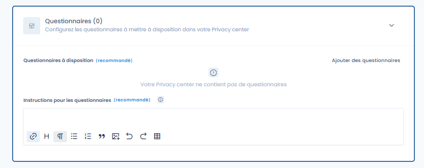
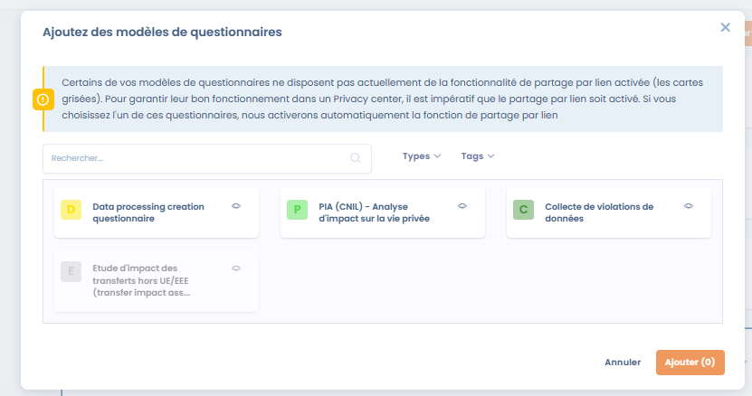
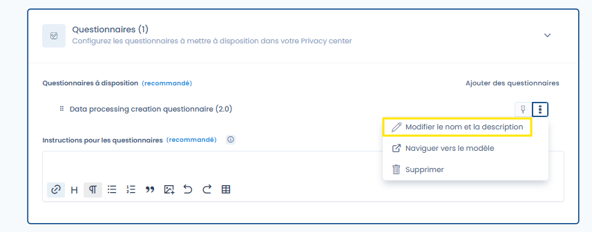
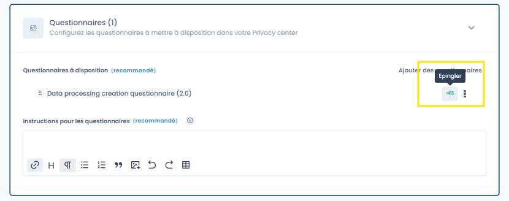

# Fragebögen

**Aktivierung der Funktion 'Fragebögen' in Ihrem Trust Center**

Um die Funktion 'Fragebögen' in Ihrem Trust Center zu aktivieren, konsultieren Sie den Abschnitt der allgemeinen Konfiguration, der die Aktivierung oder Deaktivierung dieser Option ermöglicht. Nach der Aktivierung wird Ihrem Trust Center eine neue öffentliche Seite mit dem Titel 'Fragebögen' hinzugefügt.

<figure><figcaption>
Die Konfigurationsregisterkarte für Fragebögen Ihres Trust Centers
</figcaption></figure>

#### Einen Fragebogen zu Ihrem Trust Center hinzufügen

Um einen Fragebogen hinzuzufügen, wählen Sie die in Ihrem Trust Center zu teilenden Fragebögen aus, indem Sie auf **Fragebögen hinzufügen** klicken. Ein Auswahlfenster öffnet sich, in dem Sie einen oder mehrere Fragebögen auswählen können. Klicken Sie nach Ihrer Auswahl auf **Hinzufügen** zur Bestätigung. Die verfügbaren Fragebögen entsprechen denen, die Sie im Fragebogen-Modul dieses Mandanten installiert haben.

<figure><figcaption></figcaption></figure>

Sie haben jederzeit die Möglichkeit, Fragebögen aus Ihrem Trust Center zu entfernen oder weitere hinzuzufügen. Die hinzugefügten Fragebögen sind auf der Seite 'Fragebögen' Ihres Trust Centers sichtbar.

#### Anweisungen für die Fragebögen

Dieses Rich-Text-Feld (HTML) ermöglicht es Ihnen, eine Nachricht mit Formatierungsoptionen anzupassen und Bilder oder Videos einzubetten. Diese Nachricht wird auf der öffentlichen Seite 'Fragebögen' Ihres Trust Centers oberhalb der Liste der in Ihrem Portal installierten Fragebögen angezeigt.

#### Fragebögen umbenennen

Standardmäßig tragen die in Ihrem Trust Center angezeigten Fragebögen denselben Namen wie die installierte Vorlage. Sie haben jedoch die Möglichkeit, den im Portal angezeigten Namen zu ändern, ohne den Namen der Originalvorlage zu beeinflussen, indem Sie auf **Name und Beschreibung ändern** klicken.

<figure><figcaption>
Den im Trust Center anzuzeigenden Namen und die Beschreibung ändern
</figcaption></figure>

#### Anzeigereihenfolge der Fragebögen ändern

Nach der Auswahl Ihrer Fragebögen können Sie deren Anzeigereihenfolge per Drag-and-Drop neu anordnen. Die Reihenfolge der in Ihrem öffentlichen Trust Center angezeigten Fragebögen entspricht der, die Sie auf dieser Konfigurationsseite festgelegt haben.

#### Fragebögen anheften

Um bestimmte Fragebögen hervorzuheben, klicken Sie auf das Pinnnadel-Symbol. Angeheftete Fragebögen werden immer oben in der Liste angezeigt, unabhängig von ihrer Konfigurationsreihenfolge. Darüber hinaus sind sie auch in der Seitenleiste der Startseite Ihres Hubs zugänglich, zusätzlich zur Verfügbarkeit auf der Fragebogenseite.

<figure><figcaption>
Einen Fragebogen anheften
</figcaption></figure>

#### Auswirkung der Organisationseinheitenauswahl auf die Antworten

Die Nutzer Ihres Trust Centers können alle im Portal bereitgestellten Fragebögen beantworten. Die Antworten werden im Fragebogen-Modul gespeichert und der Organisationseinheit Ihres Trust Centers zugeordnet (siehe die allgemeine Konfiguration Ihres Trust Centers).

**Wichtiger Hinweis**: Damit ein Fragebogen im Trust Center ordnungsgemäß funktioniert, muss die Option zur Linkfreigabe aktiviert sein. Wenn Sie einen Fragebogen hinzufügen möchten, bei dem diese Option nicht aktiviert ist, wird sie beim Hinzufügen des Fragebogens automatisch aktiviert. Darüber hinaus kann die Linkfreigabe-Option nicht deaktiviert werden, solange der Fragebogen in Ihrem Trust Center vorhanden ist.
