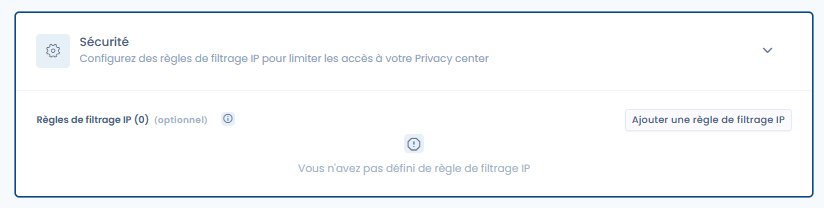

# Sicherheit

<figure><figcaption>
Die Registerkarte zur Konfiguration der IP-Filterregeln
</figcaption></figure>

Diese Registerkarte ermöglicht Ihnen den Zugriff auf die IP-Filtereinstellungen und bietet die Möglichkeit, Regeln zu definieren, um den Zugriff auf Ihr Trust Center auf bestimmte IP-Bereiche zu beschränken. Standardmäßig ist Ihr Trust Center ohne Hinzufügen von IP-Filtern für jede Person mit dem Zugangslink zugänglich, sofern das Trust Center aktiviert ist.
