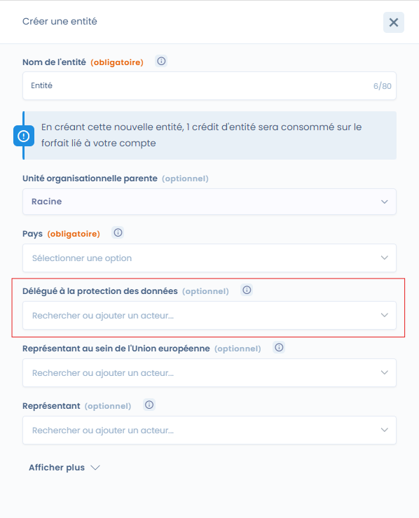
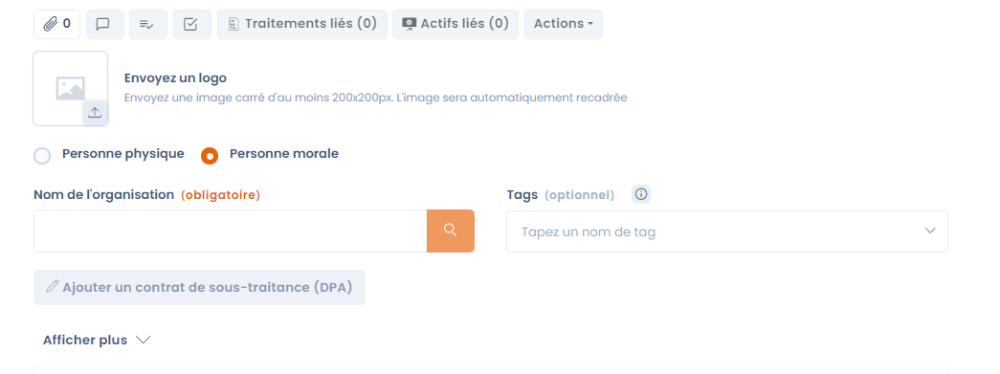

# Einen Datenschutzbeauftragten benennen

## Einen Datenschutzbeauftragten benennen

Der Datenschutzbeauftragte (DSB, oder Data Protection Officer) ist der Dirigent der DSGVO-Compliance.

Artikel 37.1 der DSGVO (Datenschutz-Grundverordnung) **schreibt die Benennung eines DSB** in 3 Fällen vor:

* Wenn die Verarbeitung von einer **öffentlichen Behörde oder Einrichtung** durchgeführt wird
* Wenn die **Kerntätigkeit** des Verantwortlichen oder des Auftragsverarbeiters in Verarbeitungsvorgängen besteht, die aufgrund ihrer Art, ihres Umfangs und/oder ihrer Zwecke eine **umfangreiche regelmäßige und systematische Überwachung von betroffenen Personen erforderlich machen**
* Wenn die **Kerntätigkeit** des Verantwortlichen oder des Auftragsverarbeiters in der **umfangreichen Verarbeitung** besonderer Datenkategorien oder von personenbezogenen Daten über strafrechtliche Verurteilungen und Straftaten besteht

Weitere Informationen zur Benennung des DSB finden Sie im Artikel "[In welchen Fällen ist die Benennung eines DSB obligatorisch?](https://www.dastra.eu/fr/guide/designation-obligatoire-ou-facultative-dun-dpo/48289)"

Lesen Sie auch unseren [Artikel über die Modalitäten der Benennung eines DSB](https://www.dastra.eu/fr/guide/les-modalites-de-designation-dun-delegue-a-la-protection-des-donnees/42392), um sicherzustellen, dass Sie die richtige Person benennen.

## Einen DSB in Dastra hinzufügen

Um einen DSB hinzuzufügen, navigieren Sie zur Verwaltung der Entität.

_**Hinweis**: Ein einzelner DSB ist einer Entität zugeordnet._

Fügen Sie dann den DSB im vorgesehenen Feld hinzu.

<figure><figcaption>
Bearbeitungsfenster einer Entität
</figcaption></figure>

Der DSB wird als Stakeholder hinzugefügt. Wenn der DSB eine natürliche Person ist, fügen Sie ihn als natürliche Person hinzu. Wenn es sich um ein Unternehmen handelt (z. B. ein externer DSB), fügen Sie ihn als juristische Person hinzu.

<figure><figcaption></figcaption></figure>

Vergessen Sie nicht zu speichern, und das war's!
