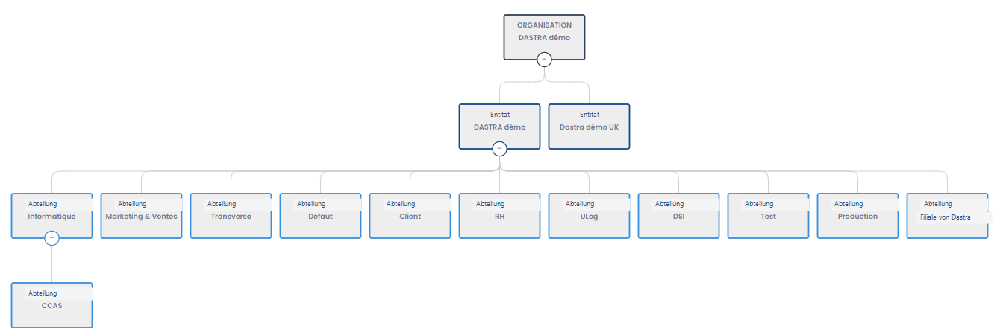

# Einen Mandanten erstellen und konfigurieren

## Bei Dastra.eu anmelden

Melden Sie sich zunächst bei [Dastra.eu](https://www.dastra.eu/) an. Wenn Sie noch kein Konto haben, [registrieren Sie sich](https://app.dastra.eu/signup) und erstellen Sie ein neues.


Sie können sofort auf Dastra zugreifen, indem Sie ein kostenloses Testkonto eröffnen, das 30 Tage gültig ist. Wenn Sie ein langfristiges Angebot abonnieren möchten, [kontaktieren Sie uns bitte](https://www.dastra.eu/fr/contact?type=quote).


## Mandant

Ein Mandant ist **eine Organisation, die ein oder mehrere Verarbeitungsverzeichnisse aufnehmen kann**. Sie können einen Mandanten pro Verarbeitungsverzeichnis und/oder pro juristische Entität oder Niederlassung erstellen, je nach Ihrer Wahl.


Ein Mandant ist eine Umgebung, die **vollständig abgeschottet** ist. Es ist nicht möglich, eine Gesamtübersicht über alle Ihre Mandanten zu erhalten. Zum Beispiel ist es nicht möglich, die Statistiken des Verarbeitungsverzeichnisses über mehrere kombinierte Mandanten einzusehen. Es ist jedoch möglich, Elemente (Verarbeitungen, Assets...) von einem Mandanten in einen anderen zu duplizieren.


### Einen Mandanten erstellen

1. Klicken Sie auf **"Neuer Mandant"**
2. Füllen Sie das Formular aus (Name, Beschreibung, ggf. Logo)
3. Bestätigen Sie, um die Erstellung zu starten

<figure><figcaption></figcaption></figure>

Füllen Sie die Felder aus und klicken Sie dann auf "**Weiter**".


Einmal erstellt, können Sie die Organisationseinheiten und Entitäten konfigurieren und Nutzer einladen.


### Auf einen Mandanten zugreifen

Um auf Ihren Mandanten zuzugreifen:

1. **Melden Sie sich bei der Anwendung an** mit Ihrem Nutzerkonto
2. **Klicken Sie auf den Mandanten** in der angezeigten Liste:
3. Sie **gelangen dann zu Ihrem Mandanten**

Sie können jederzeit den Mandanten wechseln, indem Sie auf den Selektor oben links auf dem Bildschirm klicken:

<figure><figcaption></figcaption></figure>

### Die ersten Nutzer einladen

Sobald der Mandant erstellt ist, können Sie Ihre Kollegen direkt in Ihren Bereich einladen.

Unter **"Konfiguration der Organisation" -> "Nutzer" können Sie weitere Nutzer hinzufügen:**


Sie können bestehende Nutzer zu diesem Bereich hinzufügen oder neue Nutzer einladen, indem Sie auf die Schaltfläche "Nutzer einladen" klicken.


Weisen Sie ihnen die gewünschte Rolle zu und klicken Sie auf "Weiter".

### Die erste Entität erstellen

In Dastra ist der Begriff des Mandanten von dem der juristischen Entität getrennt. So kann ein Mandant auf mehrere verschiedene juristische Entitäten verweisen (wie z. B. in einem Konzern). Es kann jedoch nur einen einzigen gesetzlichen Vertreter pro juristische Entität geben.

Jede Entität gilt als ein Verantwortlicher.


Achten Sie darauf, Entitäten und Mandanten klar zu unterscheiden.

Hier eine Erinnerung an die Begriffsdefinitionen in Dastra:

* Eine **Organisation** ist das mit Ihrem Abonnement verknüpfte Konto. Sie sehen den Namen Ihrer Organisation unterhalb Ihres Nutzernamens (oben rechts). Die Organisation enthält einen oder mehrere Mandanten.
* Ein **Mandant** ist eine technische Umgebung, die die Zusammenarbeit und Arbeit mit den Funktionen von Dastra ermöglicht. Der Mandant wird durch die Kachel dargestellt, die Sie bei der Anmeldung bei Dastra auswählen. Dieser Mandant enthält Organisationseinheiten.
* Eine **Organisationseinheit** ist ein Strukturelement im Mandanten. Man kann daran Verarbeitungen, Aufgaben, Betroffenenanfragen, Datenschutzvorfälle, Risiken anhängen. Man kann auch Nutzerrechte zuordnen. Die Organisationseinheiten unterteilen sich in Entitäten und Abteilungen.
* Eine **Entität** entspricht einem Verantwortlichen. Es handelt sich um eine juristische Entität, deren Kontaktdaten angegeben werden. Ein Datenschutzbeauftragter sowie ein Verantwortlicher können dieser Entität zugeordnet werden. Ebenso kann eine federführende Aufsichtsbehörde zugeordnet werden. Diese Entität kann in Abteilungen untergliedert werden.
* Eine **Abteilung** ist eine Organisationseinheit, die unter einer Entität positioniert ist. Diese Abteilung ermöglicht die Organisation der Entität und die Verteilung der angehängten Elemente in verschiedene Zweige. Es ist möglich, für jede Abteilung Unterabteilungen hinzuzufügen. Abteilungen können beispielsweise verwendet werden, um das Organigramm des Unternehmens abzubilden.


Um die erste juristische Entität zu erstellen, geben Sie einfach ihren Namen an und ordnen Sie ihr den Verantwortlichen (den gesetzlichen Vertreter) und, falls benannt, den Datenschutzbeauftragten oder andere Stakeholder zu. Nur der Name der juristischen Entität ist obligatorisch.

Füllen Sie die Felder aus und klicken Sie dann auf "Weiter", um Ihren Bereich zu betreten.

### Weitere Entitäten und Abteilungen erstellen (optional)

Sobald Ihr Bereich eröffnet ist, empfiehlt es sich, **sofort alle weiteren juristischen Entitäten sowie die eventuellen Abteilungen** einzutragen, um anschließend die Verwaltung der Verarbeitungen und die Zuweisung von Nutzerrechten zu vereinfachen.

Klicken Sie dazu auf den Namen Ihrer Entität oben links auf dem Bildschirm (in diesem Fall die Schaltfläche "Test"), um das Dropdown-Menü anzuzeigen, und klicken Sie dann auf die Schaltfläche "Ihren Mandanten verwalten".

Sie gelangen so zur Konfigurationsansicht der Entitäten und Abteilungen. Erstellen Sie Abteilungen, indem Sie auf die Schaltfläche "Abteilung erstellen" klicken, oder eine neue juristische Entität, indem Sie auf die Schaltfläche "Entität erstellen (Verantwortlicher)" klicken, bis das Organisationsschema Ihrer Struktur in Dastra abgebildet ist.


Sie können auch Unterabteilungen hinzufügen, indem Sie auf die Schaltfläche "Unterabteilung hinzufügen" klicken.


Herzlichen Glückwunsch, Ihr Mandant in Dastra ist erstellt und eingerichtet!

Folgen Sie dem untenstehenden Tutorial oder beginnen Sie, Dastra selbst zu erkunden.


[tutoriel](../tutoriel/)

