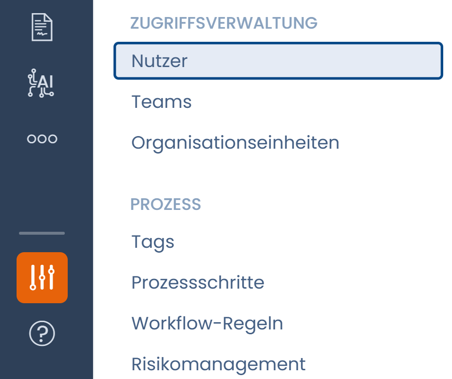
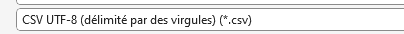
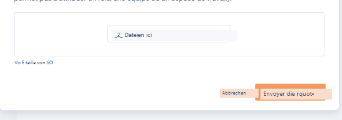

# Nutzer einladen

## Einen Nutzer einladen

Sie können jemanden zur Zusammenarbeit in Ihren Bereichen einladen, indem Sie die Person in die Organisation einladen, zu der der Bereich gehört.

Sie können Nutzer zu Ihrem Mandanten einladen, indem Sie auf die Schaltfläche "Einstellungen" unten links auf dem Bildschirm klicken, dann auf "Zugriffsverwaltung / Nutzer" und schließlich auf "Nutzer einladen":

<figure><figcaption></figcaption></figure>

Geben Sie die E-Mail-Adresse der Person ein, die Sie in Ihren Dastra-Bereich einladen möchten. Wenn diese Adresse noch nicht mit der Organisation verknüpft ist, klicken Sie darauf, um einen Einladungslink zu senden.

.png>)

Ein Formular erscheint. Geben Sie den Namen, Vornamen, die Rolle und das Team ein und klicken Sie dann auf die Schaltfläche "Einladung senden". Die eingeladene Person erhält eine E-Mail mit einem Link, der ihr nach dem Anklicken den Zugang zum Bereich ermöglicht.

Sie erhalten eine Benachrichtigungs-E-Mail, wenn die Person auf den Link klickt.\
\
Das war's, der Nutzer wurde eingeladen!

### Laufende Einladungen anzeigen

Sie können die laufenden Einladungen in den Einstellungen des Mandanten im Abschnitt "Nutzer" verwalten.

<figure><figcaption></figcaption></figure>

### Einen Einladungslink erneut senden

Wenn der eingeladene Nutzer nicht auf den Einladungslink geklickt hat und der Link abgelaufen ist (nach 10 Tagen), können Sie den Einladungslink erneut senden, indem Sie auf die Schaltfläche "Einladung erneut senden" klicken.

<figure><figcaption></figcaption></figure>

### Teams erstellen und zuweisen

In Dastra werden Nutzer in Teams gruppiert, die wiederum entweder juristischen Entitäten oder Abteilungen zugeordnet werden. So lassen sich Rollen und Verantwortlichkeiten feingranular verwalten.


In Dastra gibt es standardmäßig mehrere Rollen mit verschiedenen Berechtigungsstufen:

* **Administrator**: Administratoren können alles tun, was Mitwirkende können, und zusätzlich die Organisations- und Bereichseinstellungen ändern.
* **Mitwirkender**: Mitwirkende können Bereiche lesen und bearbeiten. Sie können Entwürfe und noch nicht veröffentlichte Änderungen sehen. Sie können Änderungen veröffentlichen. Sie können keine Organisations- oder Bereichseinstellungen ändern.
* **Leser**: Leser können nur die veröffentlichten Bereiche der Organisation besuchen. Sie können nicht bearbeiten und keine noch nicht veröffentlichten Änderungen sehen.


## Eine große Nutzerliste importieren

Wenn Sie eine große Nutzerliste importieren möchten (mindestens 50 Nutzer), können Sie den Import einer großen Nutzerliste in die Plattform anfordern. Dazu müssen Sie sich an das Dastra-Team wenden.

Sie können eine Liste von bis zu 200 Nutzern importieren lassen, im Rahmen der verfügbaren Nutzerplätze.

**Die Schritte:**

* Gehen Sie zu diesem Link: [https://app.dastra.eu/general-settings/users](https://app.dastra.eu/general-settings/users)
* Klicken Sie auf die Schaltfläche "Importieren"

<figure><figcaption></figcaption></figure>

* Erstellen Sie eine Datei pro Mandant im CSV-Format mit folgenden durch , (Komma) getrennten Spalten:

Obligatorisch:

* Email (E-Mail-Adresse des Nutzers)
* GivenName (Vorname des Nutzers)
* FamilyName (Nachname des Nutzers)
* Roles (getrennt durch |) > entspricht den Rollen in Dastra
* Teams (getrennt durch |) > entspricht den Teams in Dastra

Optional:

* SsoConfigurationId > entspricht der SSO-Login-Kennung, falls zutreffend

Hier eine Dateivorlage zum Herunterladen und Ausfüllen:


Importdatei-Vorlage


**Zu den Rollen-Kennungen:**

Standardmäßig haben die Basisrollen folgende Kennungen:

* Administrator = 1
* Mitwirkender = 2
* Leser = 3

Für benutzerdefinierte Rollen, die Sie erstellt haben, ist die Kennung über die Entwicklerkonsole Ihres Browsers im Netzwerk-Tab sichtbar.


Um die Konsole in Chrome zu öffnen, verwenden Sie das Tastenkürzel: Cmd + Option + C (auf Mac) oder Strg + Umschalt + J (unter Windows)

Um die Konsole in Firefox zu öffnen, verwenden Sie das Tastenkürzel: Cmd + Option + K (auf Mac) oder Strg + Umschalt + J (unter Windows)

Um die Konsole zu öffnen, können Sie das Tastenkürzel verwenden: Cmd + Option + C

Um die Konsole in Microsoft Edge zu öffnen, können Sie das Tastenkürzel verwenden: Strg + Umschalt + I


Achtung, die Rollen müssen vorab erstellt werden.

<figure><figcaption></figcaption></figure>

**Zu den Team-Kennungen:**

Die Teams müssen durch Kennungsnummern identifiziert werden, die durch Öffnen eines Teams in Dastra (über die Schaltfläche "Bearbeiten") abgerufen werden.

<figure><figcaption></figcaption></figure>

Im folgenden Bild ist die Kennung des Teams **id:9390**.

Hinweis: Teams sind in Dastra nicht obligatorisch.


Achtung, die Teams müssen vorab im Mandanten erstellt werden.


Speichern Sie Ihre Datei im Format CSV UTF-8

<figure><figcaption></figcaption></figure>

Sobald Ihre Datei fertig ist, geben Sie uns an, in welchen Mandanten Sie die Nutzer importieren möchten, und laden Sie die Datei über die Upload-Oberfläche hoch:

<figure><figcaption></figcaption></figure>

Wir erhalten die Anfrage und melden uns bei Ihnen zur Nachverfolgung.
