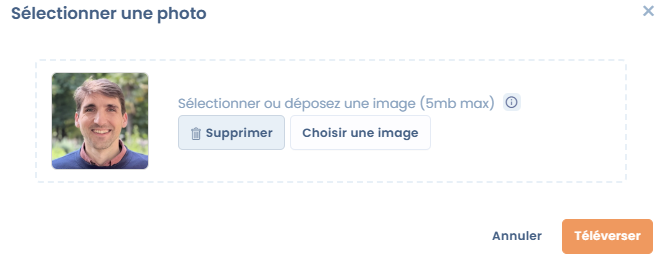
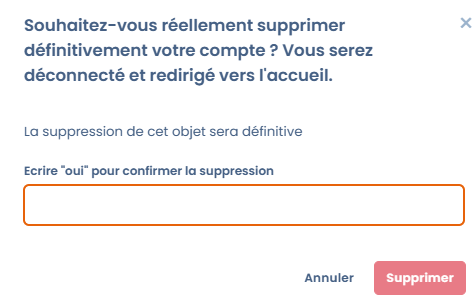

# Ihr Nutzerprofil einrichten

### 🧭 Überblick

Jeder Dastra-Nutzer verfügt über ein **persönliches Profil** mit seinen Identifikationsdaten, Sprach- und Anzeigeeinstellungen sowie Optionen zur Kontosicherheit.

Diese Seite erklärt, wie Sie diese Informationen über das Menü **Nutzerprofil** ändern können, das über Ihren Avatar oben rechts auf dem Bildschirm zugänglich ist.

***

### 🖼️ Profilbild

Sie können ein Logo oder Profilbild hinzufügen, das in Ihren Mandanten und in Ihren Kommentaren sichtbar ist.

* **Format:** quadratisches Bild mit mindestens **200 x 200 px**
* **Akzeptierte Formate:** PNG, JPG oder WebP
* **Automatischer Zuschnitt:** Dastra passt das quadratische Format automatisch an

<figure><figcaption></figcaption></figure>


Wählen Sie ein einfaches und wiedererkennbares Bild (z. B. Ihr Foto oder das Logo Ihrer Organisation).


***

### 🧾 Persönliche Informationen

Die folgenden Felder können jederzeit ausgefüllt oder aktualisiert werden:

| Feld                                                      | Beschreibung                                                               | Pflicht       |
| --------------------------------------------------------- | -------------------------------------------------------------------------- | ------------- |
| **Vorname**                                               | Ihr Vorname, wie er in Dastra angezeigt wird                               | ✅ Pflichtfeld |
| **Nachname**                                              | Ihr Nachname                                                               | ✅ Pflichtfeld |
| **Öffentlicher Spitzname**                                | Angezeigter Spitzname in Kommentaren oder bei externen Freigaben           | Optional      |
| **Telefonnummer**                                         | Verwendet für bestimmte Benachrichtigungen oder Zwei-Faktor-Validierungen  |               |
| **Postanschrift / Postleitzahl / Stadt / Region / Land**  | Berufliche oder persönliche Kontaktdaten je nach Kontext                   | Optional      |
| **Blog / Website**                                        | Link zu Ihrer beruflichen Website oder LinkedIn                            | Optional      |
| **Biografie**                                             | Kurze Beschreibung Ihrer Rolle oder Funktion                               | Optional      |
| **Profil-E-Mail**                                         | Mit Ihrem Dastra-Konto verknüpfte Adresse                                 | ✅ Pflichtfeld |

### 🌐 Sprache und Zeitzone

Sie können die Anzeige von Dastra nach Ihrer Sprache und Zeitzone anpassen.

| Einstellung                 | Beschreibung                                                                                     |
| --------------------------- | ------------------------------------------------------------------------------------------------ |
| **Sprache der Oberfläche**  | In der Anwendung verwendete Sprache (Deutsch, Englisch usw.). Standardmäßig sind 9 Sprachen verfügbar. |
| **Zeitzone**                | Standardmäßig (UTC+01:00) Mitteleuropäische Zeit (Paris)                                         |


Diese Einstellungen beeinflussen nur **Ihre persönliche Anzeige**.\
Sie ändern nicht die Standardsprache der anderen Mitglieder des Workspace.


***

### ♻️ Einstellungsdaten zurücksetzen

Diese Option ermöglicht es, die in Ihrem Browser gespeicherten **lokalen Einstellungen** zurückzusetzen.

> Dies löscht:
>
> * die von Dastra gesetzten Cookies,
> * die lokal gespeicherten Daten (localStorage),
> * die Anzeige- und Spalteneinstellungen in Tabellen,
> * die als "bereits gesehen" markierten Tutorials in den Modulen.


Diese Aktion ist **unwiderruflich**: Ihre Einstellungen gehen verloren und die Anzeige einiger Module wird wie bei Ihrer ersten Anmeldung zurückgesetzt.


***

### 🗑️ Nutzerkonto löschen

Wenn Sie Dastra endgültig verlassen möchten, können Sie **Ihr Nutzerkonto löschen**.

> Diese Aktion bewirkt:
>
> * Die endgültige Löschung Ihres **Profils**
> * Den Verlust Ihrer **Zugriffsrechte** und Ihrer **zugeordneten Teams**
> * Die vollständige Löschung Ihrer **personenbezogenen Daten**


Endgültige Löschung: Nach der Bestätigung ist **die Löschung unwiderruflich**.\
Eine Wiederherstellung ist nicht möglich.


<figure><figcaption></figcaption></figure>

***

### 💡 Bewährte Praktiken

* Halten Sie Ihre Kontaktdaten aktuell, um die Kontinuität der Kommunikation sicherzustellen.
* Verwenden Sie einen professionellen Spitznamen für die Dastra-Community.
* Informieren Sie vor der Löschung Ihres Kontos Ihren Administrator, um Datenverlust zu vermeiden.&#x20;

***

### 🔗 Siehe auch

* [Ihre Benachrichtigungen einrichten](../../features/settings/notifications.md)
* [Rollen und Berechtigungen konfigurieren](../../features/settings/roles-et-permissions.md)
* Anmelden und Authentifizierung verwalten
