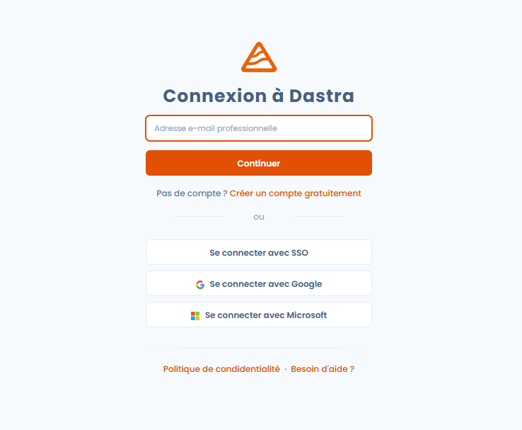
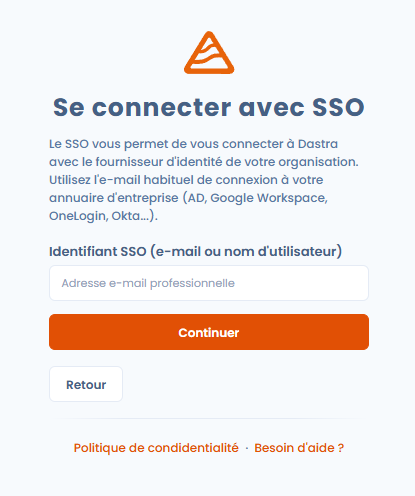
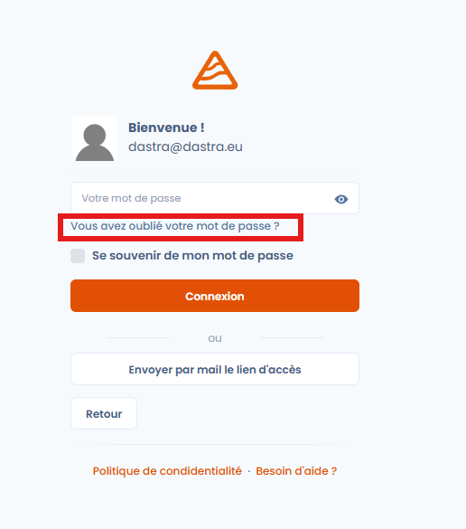
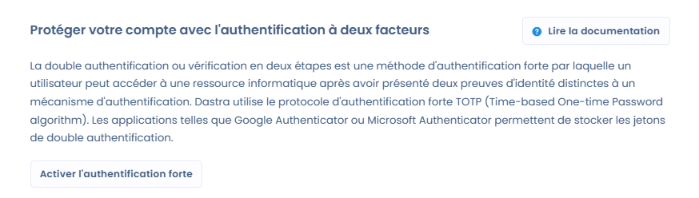

# Anmelden und Authentifizierung verwalten

### 🧭 Überblick

Der Zugang zu Dastra ist durch ein Authentifizierungssystem gesichert, das den besten Datenschutzpraktiken entspricht.\
Sie können sich mit Ihren Dastra-Zugangsdaten, einem Drittanbieter-Konto (SSO) anmelden und die Sicherheit Ihres Kontos durch die **Zwei-Faktor-Authentifizierung (2FA)** verstärken.

***

### 🚪 Bei Dastra anmelden

#### 🔑 Mit Dastra-Zugangsdaten

1. Besuchen Sie [https://app.dastra.eu](https://app.dastra.eu)
2. Geben Sie Ihre **E-Mail-Adresse** und Ihr **Passwort** ein
3. Klicken Sie auf **Anmelden**

<figure><figcaption></figcaption></figure>


Aktivieren Sie die Option **Passwort merken**, wenn Sie ein persönliches Gerät verwenden, um Ihre Zugangsdaten nicht bei jedem Besuch erneut eingeben zu müssen.


***

#### 🌐 Über einen Identitätsanbieter (SSO)

Wenn Ihre Organisation ein **SSO (Single Sign-On)** konfiguriert hat, können Sie sich über Ihren Identitätsanbieter anmelden (z. B. Microsoft, Google, Okta…).

1. Klicken Sie auf der Anmeldeseite auf **Mit SSO anmelden**
2. Geben Sie Ihre E-Mail-Adresse ein
3. Folgen Sie dem Authentifizierungsverfahren Ihrer Organisation
4. Sie werden automatisch zu Ihrem Dastra-Bereich weitergeleitet

<figure><figcaption></figcaption></figure>


SSO vereinfacht die Zugriffsverwaltung und verstärkt die Sicherheit: Ihre Zugangsdaten werden niemals mit Dastra geteilt.


***

### 🔄 Ihr Passwort zurücksetzen

Falls Sie Ihr Passwort vergessen haben:

1. Klicken Sie auf **Passwort vergessen?** auf der Anmeldeseite
2. Geben Sie die mit Ihrem Konto verknüpfte E-Mail-Adresse ein
3. Prüfen Sie Ihr Postfach und folgen Sie dem Link zum Zurücksetzen
4. Wählen Sie ein neues Passwort gemäß den Sicherheitskriterien

<figure><figcaption></figcaption></figure>


Die Links zum Zurücksetzen laufen aus Sicherheitsgründen nach kurzer Zeit ab.\
Falls der Link nicht mehr funktioniert, starten Sie den Vorgang erneut.


***

### 🔒 Zwei-Faktor-Authentifizierung (2FA) aktivieren

Die **Zwei-Faktor-Authentifizierung** verstärkt die Sicherheit Ihres Dastra-Kontos.\
Sie fügt bei der Anmeldung einen zusätzlichen Schritt hinzu: die Eingabe eines **einmaligen Codes, der auf Ihrem Telefon generiert wird**.

#### ⚙️ Aktivierung

1. Gehen Sie zu **Nutzerprofil → Kontosicherheit**
2. Klicken Sie auf **Zwei-Faktor-Authentifizierung aktivieren**
3. Scannen Sie den QR-Code mit einer Authentifizierungs-App (Google Authenticator, Authy, 1Password usw.)
4. Geben Sie den generierten Code ein, um die Aktivierung zu bestätigen

<figure><figcaption></figcaption></figure>


Bewahren Sie den bei der Aktivierung angezeigten **Wiederherstellungscode** auf.\
Er ermöglicht Ihnen den Zugang zu Ihrem Konto, falls Sie Ihr Gerät verlieren.


Erfahren Sie mehr über die [starke Authentifizierung](../../security/mfa.md).

***

### 📱 Anmeldung mit aktivierter 2FA

Sobald die 2FA aktiviert ist, verläuft die Anmeldung in zwei Schritten:

1. Geben Sie Ihren **Benutzernamen und Ihr Passwort** ein
2. Geben Sie den **6-stelligen Validierungscode** ein, der von Ihrer Authentifizierungs-App generiert wird


Gut zu wissen: Der 2FA-Code wechselt alle 30 Sekunden und kann nur einmal verwendet werden.


***

### 🧹 Aktive Sitzungen verwalten

Dastra ermöglicht es Ihnen, die mit Ihrem Konto verknüpften **aktiven Sitzungen** einzusehen und zu beenden.

1. Gehen Sie zu **Profil → Kontosicherheit → Aktive Sitzungen**
2. Sehen Sie die Liste der verbundenen Geräte und Browser ein
3. Klicken Sie auf **Entfernen**, um ein bestimmtes Gerät abzumelden


Beenden Sie unbekannte Sitzungen sofort, um unbefugten Zugriff auf Ihre Daten zu vermeiden.


***

### 🧰 Bewährte Sicherheitspraktiken

* Verwenden Sie ein **einzigartiges und starkes Passwort** (mindestens 12 Zeichen, mit Groß- und Kleinbuchstaben, Ziffern und Sonderzeichen).
* Teilen Sie niemals Ihre Zugangsdaten, auch nicht intern.
* Aktivieren Sie die **Zwei-Faktor-Authentifizierung** für alle Ihre beruflichen Konten.
* Melden Sie sich auf gemeinsam genutzten oder öffentlichen Geräten ab.
* Überprüfen Sie regelmäßig Ihre aktiven Sitzungen.

***

### 🔗 Siehe auch

* [Ihr Nutzerprofil einrichten](parametrer-votre-profil-utilisateur.md)
* [Benachrichtigungen konfigurieren](../../features/settings/notifications.md)
* [Sicherheits- und Datenschutzrichtlinie von Dastra](../../security/general.md)
