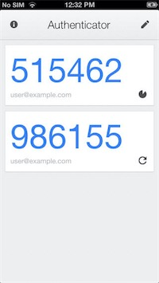

# Zwei-Faktor-Authentifizierung

## Einführung

Dastra verwendet die [TOTP](https://de.wikipedia.org/wiki/Time-based_one-time_password)-Technologie zur Verwaltung der [Multi-Faktor-Authentifizierung](https://de.wikipedia.org/wiki/Multi-Faktor-Authentisierung) der Nutzer.\
Die Nutzer können sich somit sowohl mit ihrem üblichen Passwort als auch mit einem 6-stelligen Code anmelden, der von einer Secrets-Speicher-App wie Microsoft Authenticator oder Google Authenticator (oder anderen) bereitgestellt wird.

## Wie aktiviert man die starke Authentifizierung?

* Navigieren Sie zu https://app.dastra.eu/general-settings/two-factor
* Klicken Sie auf "**Zwei-Faktor-Authentifizierung aktivieren**"
* Laden Sie eine Zwei-Faktor-Authentifizierungs-App herunter
* **Scannen Sie den QR-Code** mit der von Ihnen gewählten App

* Bewahren Sie den Wiederherstellungscode sicher auf.
* Melden Sie sich mit dem 6-stelligen Code an, der von Ihrer Authentifizierungs-App bereitgestellt wird


Bewahren Sie den Wiederherstellungscode sorgfältig auf! Dieser ermöglicht es Ihnen, Ihr Konto wiederherzustellen, falls Sie Ihre Authentifizierungs-App verlieren. Ihr Konto wird dauerhaft gesperrt, wenn Sie diesen Code nicht vorlegen können. In diesem Fall müssen Sie sich an den Eigentümer Ihrer Organisation wenden, damit er die Zwei-Faktor-Authentifizierung Ihres Kontos zurücksetzt.


## Wie erzwingt man die Zwei-Faktor-Authentifizierung für alle Nutzer?

* Navigieren Sie zu https://app.dastra.eu/general-settings/security
* Aktivieren Sie das Kontrollkästchen für die erzwungene Zwei-Faktor-Authentifizierung.


Alle Nutzer, die sich anmelden, werden keinen Zugang zur Anwendung haben, ohne die Zwei-Faktor-Authentifizierung in ihrem Konto konfiguriert zu haben. Stellen Sie sicher, dass Ihr Team über die Best Practices zur Aufbewahrung der geheimen TOTP-Schlüssel informiert ist.

